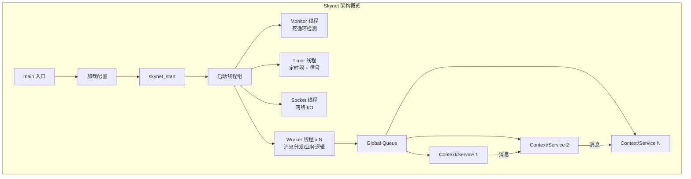
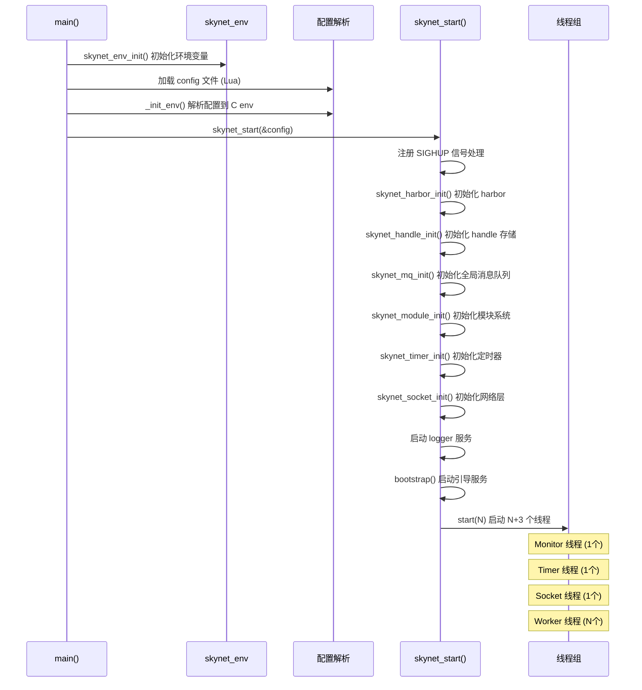

# Skynet 项目总览文档

## 一、项目简介

Skynet 是一个**基于 Actor 模型的多用户 Lua 框架**，由云风（cloudwu）开发，广泛应用于中国游戏行业。它将 Actor 模型与 Lua 协程相结合，实现了高并发、轻量级的服务架构。

- **语言**：核心用 C 编写，业务逻辑用 Lua
- **并发模型**：Actor 模型（每个服务是独立的 Actor，通过消息通信）
- **许可证**：MIT License
- **仓库**：https://github.com/cloudwu/skynet

## 二、核心设计理念



### 核心概念

| 概念 | 说明 |
|------|------|
| **Service (Context)** | 最小的执行单元，每个服务有独立的消息队列和回调函数 |
| **Handle** | 32 位服务地址，高 8 位为 harbor id（节点标识），低 24 位为节点内唯一 ID |
| **Message Queue** | 每个服务拥有的消息队列，环形缓冲区实现 |
| **Global Queue** | 全局消息队列链表，有消息的服务排队等待 Worker 处理 |
| **Worker Thread** | 工作线程，从 Global Queue 取服务，从服务队列取消息，执行回调 |
| **Harbor** | 节点标识，用于多节点集群通信 |

## 三、项目目录结构

```
skynet/
├── skynet-src/          ← 核心 C 源码（框架引擎）
│   ├── skynet_main.c    # 入口 main()
│   ├── skynet_start.c   # 启动逻辑 + 4 类线程实现（★核心循环）
│   ├── skynet_server.c  # Context/Service 生命周期管理
│   ├── skynet_handle.c  # Handle 注册/查找/存储
│   ├── skynet_mq.c      # 消息队列（全局队列 + 服务队列）
│   ├── skynet_module.c  # C 模块动态加载（dlopen）
│   ├── skynet_timer.c   # 多级时间轮定时器
│   ├── skynet_socket.c  # 网络层封装
│   ├── skynet_harbor.c  # 集群/节点间通信
│   ├── skynet_monitor.c # 死循环检测
│   ├── skynet_log.c     # 日志输出
│   ├── skynet_env.c     # 环境变量（基于 Lua state）
│   ├── socket_server.c  # 底层 socket 事件驱动（epoll/kqueue）
│   └── skynet.h         # 公共 API 头文件
│
├── service-src/         ← C 服务实现（编译为 .so 动态加载）
│   ├── service_snlua.c  # ★Lua 服务宿主（最重要，加载 Lua state）
│   ├── service_gate.c   # 网关服务（TCP 连接管理）
│   ├── service_harbor.c # 集群通信服务
│   └── service_logger.c # 日志服务
│
├── service/             ← Lua 服务（由 snlua 加载执行）
│   ├── bootstrap.lua    # ★启动引导（第一个 Lua 服务）
│   ├── launcher.lua     # 服务启动器/管理器
│   ├── gate.lua         # Lua 层网关逻辑
│   ├── snaxd.lua        # Snax 框架宿主
│   ├── clusterd.lua     # 集群守护
│   └── ...
│
├── lualib/              ← Lua 库（框架 API + 工具库）
│   ├── skynet.lua       # ★Skynet Lua API（send/call/fork 等）
│   ├── loader.lua       # Lua 模块加载器
│   ├── sproto.lua       # Sproto 协议库
│   ├── skynet/          # 子模块（socket/snax/cluster 等）
│   ├── snax/            # Snax 框架（gateserver 等）
│   └── http/            # HTTP/WebSocket 支持
│
├── lualib-src/          ← Lua C 扩展（编译为 .so）
│   ├── lua-skynet.c     # ★skynet.core 模块（Lua ↔ C 桥梁）
│   ├── lua-socket.c     # socket 操作
│   ├── lua-netpack.c    # 网络封包
│   ├── lua-cluster.c    # 集群支持
│   ├── lua-sharedata.c  # 共享数据
│   └── ...
│
├── examples/            ← 示例代码
├── 3rd/                 ← 第三方库（lua/jemalloc/lpeg）
├── test/                ← 测试
├── Makefile             # Linux 编译
├── platform.mk          # 平台检测
└── mingw.mk            # MinGW 编译
```

## 四、启动流程



## 五、消息类型系统

定义在 `skynet.h` 和 `lualib/skynet.lua` 中：

| 类型 | 值 | 说明 |
|------|-----|------|
| `PTYPE_TEXT` | 0 | 文本消息（Lua 默认类型） |
| `PTYPE_RESPONSE` | 1 | 响应消息（定时器/RPC 回包） |
| `PTYPE_MULTICAST` | 2 | 多播消息 |
| `PTYPE_CLIENT` | 3 | 客户端消息 |
| `PTYPE_SYSTEM` | 4 | 系统消息 |
| `PTYPE_HARBOR` | 5 | 集群/节点间消息 |
| `PTYPE_SOCKET` | 6 | Socket 事件消息 |
| `PTYPE_ERROR` | 7 | 错误消息 |

消息类型编码在 `skynet_message.sz` 的高 8 位中：
```c
#define MESSAGE_TYPE_MASK (SIZE_MAX >> 8)
#define MESSAGE_TYPE_SHIFT ((sizeof(size_t)-1) * 8)
```

## 六、各模块详细文档索引

| 文档 | 内容 |
|------|------|
| [01-核心循环详解](./01-核心循环详解.md) | ★ 线程模型、Worker 消息分发循环、定时器驱动、Socket 事件循环 |
| [02-skynet-src 核心层](./02-skynet-src-核心层.md) | main/start/server/handle/mq/module/timer/socket/harbor/monitor/log/env |
| [03-service-src 服务层](./03-service-src-服务层.md) | snlua/gate/harbor/logger C 服务实现 |
| [04-service Lua 服务](./04-service-Lua服务.md) | bootstrap/launcher/gate/cluster/snaxd 等 Lua 服务 |
| [05-lualib 库](./05-lualib-库.md) | skynet.lua API / skynet 子模块 / snax / http / sproto |
| [06-lualib-src C扩展](./06-lualib-src-C扩展.md) | lua-skynet / lua-socket / lua-cluster / lua-sharedata 等 |
| [07-examples 示例](./07-examples-示例.md) | main/watchdog/agent/gate 示例服务 |
| [08-Lua虚拟机详解](./08-Lua虚拟机详解.md) | ★ lua_State 基础、3 处 lua_State 详解、service_snlua 核心、协程调度、C API 绑定、内存管理 |
