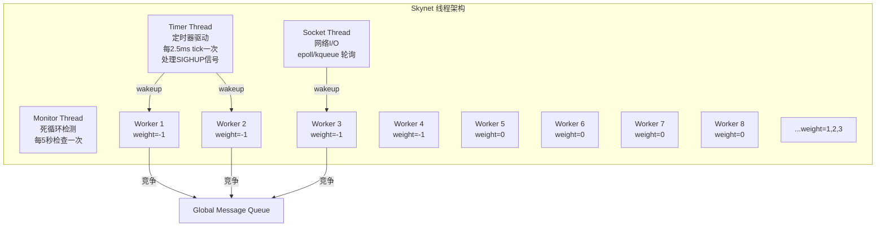
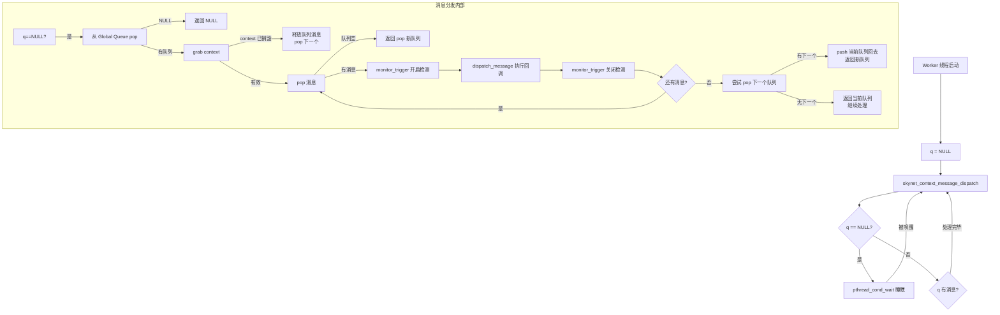
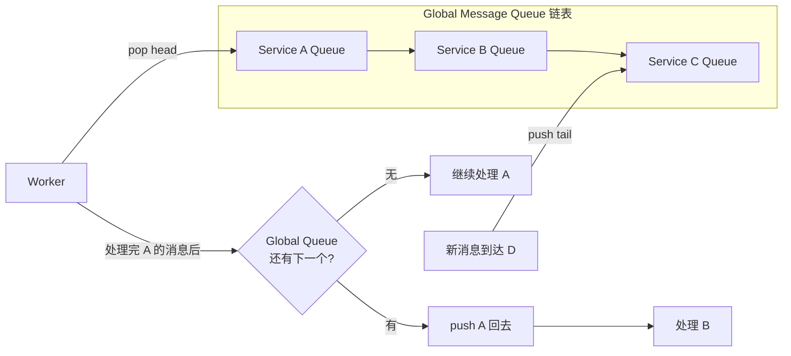
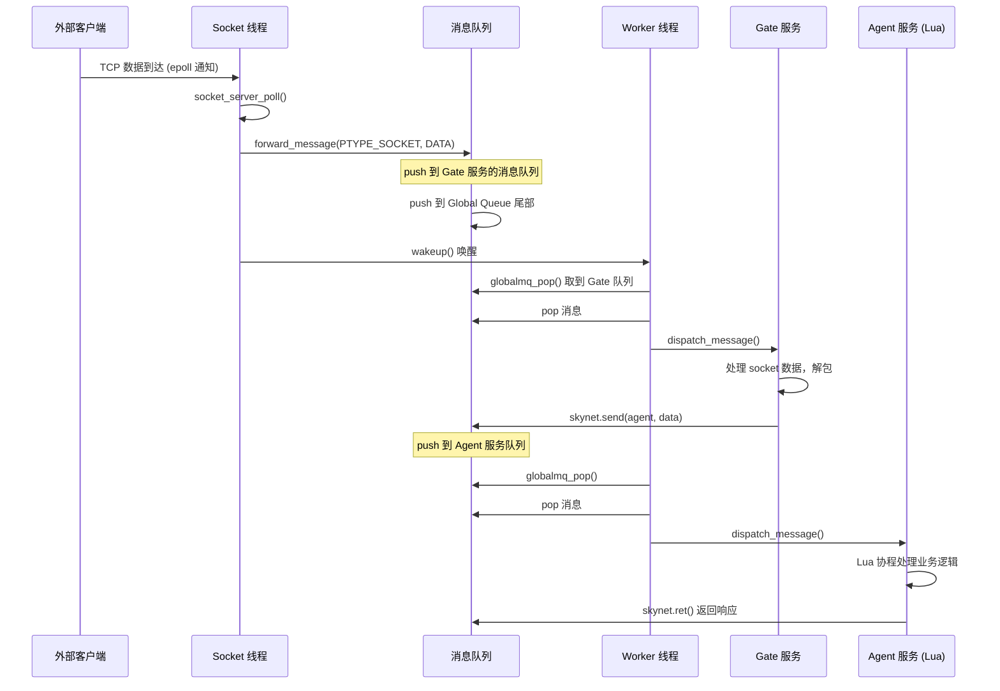

# Skynet 核心循环详解

> 本文档是 Skynet 学习的最关键部分。核心循环代码集中在 `skynet-src/skynet_start.c` 和 `skynet-src/skynet_server.c` 中。

## 目录

- [一、线程模型全景](#一线程模型全景)
  - [Weight 权重机制](#weight-权重机制)
- [二、Worker 线程核心循环（★最关键）](#二worker-线程核心循环最关键)
  - [源码位置：`skynet_start.c` → `thread_worker()`](#源码位置skynet_startc--thread_worker)
  - [流程图](#流程图)
- [三、消息分发详解：`skynet_context_message_dispatch`](#三消息分发详解skynet_context_message_dispatch)
  - [`dispatch_message` 内部](#dispatch_message-内部)
- [四、Timer 线程核心循环](#四timer-线程核心循环)
  - [定时器实现：多级时间轮](#定时器实现多级时间轮)
- [五、Socket 线程核心循环](#五socket-线程核心循环)
- [六、Monitor 线程（死循环检测）](#六monitor-线程死循环检测)
- [七、全局队列调度算法](#七全局队列调度算法)
- [八、一次完整的消息处理时间线](#八一次完整的消息处理时间线)
- [九、关键数据结构](#九关键数据结构)
  - [`skynet_context`（服务/ Actor）](#skynet_context服务-actor)
  - [`skynet_message`（消息）](#skynet_message消息)
  - [`message_queue`（消息队列）](#message_queue消息队列)
- [十、退出流程](#十退出流程)
- [十一、总结](#十一总结)

---

## 一、线程模型全景

Skynet 启动后共运行 **N+3 个线程**（N = 配置的 worker 数量，默认 8）：



### Weight 权重机制

Worker 线程的 weight 决定了每次从消息队列中**批量处理消息的数量**：

```c
// 来自 skynet_start.c
static int weight[] = {
    -1, -1, -1, -1, 0, 0, 0, 0,   // 前8个 worker
    1, 1, 1, 1, 1, 1, 1, 1,       // 9-16
    2, 2, 2, 2, 2, 2, 2, 2,       // 17-24
    3, 3, 3, 3, 3, 3, 3, 3,       // 25-32
};
```

批量处理逻辑（`skynet_server.c` 中 `skynet_context_message_dispatch`）：

```c
int i, n = 1;
for (i = 0; i < n; i++) {
    // 取一条消息...
    if (i == 0 && weight >= 0) {
        n = skynet_mq_length(q);    // 获取队列长度
        n >>= weight;               // n = n / (2^weight)
    }
    // 处理消息...
}
```

| Weight | 效果 | 说明 |
|--------|------|------|
| -1 | 每次只处理 1 条消息 | 公平调度，适用于有 I/O 等待的 worker |
| 0 | n = length / 1 | 处理队列中所有消息 |
| 1 | n = length / 2 | 处理一半 |
| 2 | n = length / 4 | 处理四分之一 |
| 3 | n = length / 8 | 处理八分之一 |

## 二、Worker 线程核心循环（★最关键）

### 源码位置：`skynet_start.c` → `thread_worker()`

```c
static void *
thread_worker(void *p) {
    struct worker_parm *wp = p;
    int id = wp->id;
    int weight = wp->weight;
    struct monitor *m = wp->m;
    struct skynet_monitor *sm = m->m[id];
    skynet_initthread(THREAD_WORKER);
    skynet_handle_register_thread();       // 注册 TLS slot 用于无锁读
    
    struct message_queue * q = NULL;
    while (!m->quit) {
        // ★核心：消息分发
        q = skynet_context_message_dispatch(sm, q, weight);
        
        if (q == NULL) {
            // 全局队列为空，进入睡眠等待
            pthread_mutex_lock(&m->mutex);
            ++m->sleep;
            if (!m->quit)
                pthread_cond_wait(&m->cond, &m->mutex);
            --m->sleep;
            pthread_mutex_unlock(&m->mutex);
        }
    }
    return NULL;
}
```

### 流程图



## 三、消息分发详解：`skynet_context_message_dispatch`

**源码位置**：`skynet-src/skynet_server.c`

```c
struct message_queue *
skynet_context_message_dispatch(struct skynet_monitor *sm, 
                                 struct message_queue *q, 
                                 int weight) {
    // 步骤 1：如果 q 为空，从全局队列取一个
    if (q == NULL) {
        q = skynet_globalmq_pop();
        if (q == NULL) return NULL;  // 全局队列空
    }

    uint32_t handle = skynet_mq_handle(q);

    // 步骤 2：通过 handle 获取 context
    struct skynet_context * ctx = skynet_handle_grab(handle);
    if (ctx == NULL) {
        // context 已被销毁，丢弃队列中所有消息
        struct drop_t d = { handle };
        skynet_mq_release(q, drop_message, &d);
        return skynet_globalmq_pop();  // 取下一个
    }

    // 步骤 3：批量处理消息
    int i, n = 1;
    struct skynet_message msg;

    for (i = 0; i < n; i++) {
        // 从服务队列 pop 一条消息
        if (skynet_mq_pop(q, &msg)) {
            // 队列已空
            skynet_context_release(ctx);
            return skynet_globalmq_pop();
        } 
        // 根据 weight 计算批量处理数量
        else if (i == 0 && weight >= 0) {
            n = skynet_mq_length(q);
            n >>= weight;  // n = n / 2^weight
        }
        
        // 步骤 4：过载检测
        int overload = skynet_mq_overload(q);
        if (overload) {
            skynet_error(ctx, "May overload, queue length = %d", overload);
        }

        // 步骤 5：Monitor 触发（死循环检测）
        skynet_monitor_trigger(sm, msg.source, handle);

        if (ctx->cb == NULL) {
            skynet_free(msg.data);
        } else {
            // ★步骤 6：执行消息回调
            dispatch_message(ctx, &msg);
        }

        // 步骤 7：Monitor 重置
        skynet_monitor_trigger(sm, 0, 0);
    }

    // 步骤 8：调度决策
    assert(q == ctx->queue);
    struct message_queue *nq = skynet_globalmq_pop();
    if (nq) {
        // 全局队列还有别的服务在排队，push 当前队列回去
        skynet_globalmq_push(q);
        q = nq;
    }
    // 否则返回 q，继续处理当前服务
    
    skynet_context_release(ctx);
    return q;
}
```

### `dispatch_message` 内部

```c
static void
dispatch_message(struct skynet_context *ctx, struct skynet_message *msg) {
    CHECKCALLING_BEGIN(ctx)
    pthread_setspecific(G_NODE.handle_key, (void *)(uintptr_t)(ctx->handle));
    
    int type = msg->sz >> MESSAGE_TYPE_SHIFT;  // 提取消息类型
    size_t sz = msg->sz & MESSAGE_TYPE_MASK;    // 提取消息大小
    
    // 日志记录（如果配置了 logpath）
    FILE *f = (FILE *)ATOM_LOAD(&ctx->logfile);
    if (f) {
        skynet_log_output(f, msg->source, type, msg->session, msg->data, sz);
    }
    
    ++ctx->message_count;
    
    int reserve_msg;
    if (ctx->profile) {
        // Profile 模式：记录 CPU 时间
        ctx->cpu_start = skynet_thread_time();
        reserve_msg = ctx->cb(ctx, ctx->cb_ud, type, msg->session, 
                              msg->source, msg->data, sz);
        uint64_t cost_time = skynet_thread_time() - ctx->cpu_start;
        ctx->cpu_cost += cost_time;
    } else {
        // ★调用服务注册的回调函数
        reserve_msg = ctx->cb(ctx, ctx->cb_ud, type, msg->session, 
                              msg->source, msg->data, sz);
    }
    
    // 如果回调返回 0，释放消息内存
    if (!reserve_msg) {
        skynet_free(msg->data);
    }
    CHECKCALLING_END(ctx)
}
```

## 四、Timer 线程核心循环

**源码位置**：`skynet_start.c` → `thread_timer()`

```c
static void *
thread_timer(void *p) {
    struct monitor * m = p;
    skynet_initthread(THREAD_TIMER);
    skynet_handle_register_thread();
    
    for (;;) {
        skynet_updatetime();         // ★驱动定时器
        skynet_socket_updatetime();  // 驱动 socket 超时检查
        CHECK_ABORT                  // 所有 context 退出则 break
        
        wakeup(m, m->count-1);       // 唤醒所有 worker
        
        usleep(2500);                // 睡眠 2.5ms
        
        if (SIG) {
            signal_hup();            // SIGHUP 信号：重新打开日志
            SIG = 0;
        }
    }
    
    // 退出流程
    skynet_socket_exit();            // 通知 socket 线程退出
    pthread_mutex_lock(&m->mutex);
    m->quit = 1;
    pthread_cond_broadcast(&m->cond); // 唤醒所有 worker
    pthread_mutex_unlock(&m->mutex);
    return NULL;
}
```

### 定时器实现：多级时间轮

**源码位置**：`skynet-src/skynet_timer.c`

```c
#define TIME_NEAR_SHIFT 8
#define TIME_NEAR (1 << TIME_NEAR_SHIFT)    // 256 个槽
#define TIME_LEVEL_SHIFT 6
#define TIME_LEVEL (1 << TIME_LEVEL_SHIFT)  // 64 个槽

struct timer {
    struct link_list near[TIME_NEAR];        // 最近 256 tick (~640ms)
    struct link_list t[4][TIME_LEVEL];       // 4 级时间轮
    struct spinlock lock;
    uint32_t time;       // 当前 tick 计数
    uint64_t current;    // 当前时间
};
```

**精度**：每个 tick = 10ms（100  ticks/秒），`skynet_updatetime()` 每次推进一个 tick。

**时间轮覆盖范围**：
- near 轮：256 ticks × 10ms = 2.56 秒
- level 0: 256 × 64 ticks = 16,384 ticks ≈ 164 秒
- level 1: 256 × 64² ticks ≈ 2.9 小时
- level 2: 256 × 64³ ticks ≈ 7.7 天
- level 3: 256 × 64⁴ ticks ≈ 1.35 年

**`timer_update` 工作流程**：

```c
static void timer_update(struct timer *T) {
    SPIN_LOCK(T);
    timer_execute(T);    // 1. 先执行可能存在的 timeout 0
    timer_shift(T);      // 2. 推进时间轮
    timer_execute(T);    // 3. 执行当前槽位到期定时器
    SPIN_UNLOCK(T);
}
```

定时器到期后，通过向目标服务发送 `PTYPE_RESPONSE` 消息来触发超时回调：

```c
static inline void
dispatch_list(struct timer_node *current) {
    do {
        struct timer_event * event = (struct timer_event *)(current+1);
        struct skynet_message message;
        message.source = 0;
        message.session = event->session;
        message.data = NULL;
        message.sz = (size_t)PTYPE_RESPONSE << MESSAGE_TYPE_SHIFT;
        skynet_context_push(event->handle, &message);  // 推送消息
        // ...
    } while (current);
}
```

## 五、Socket 线程核心循环

**源码位置**：`skynet_start.c` → `thread_socket()`

```c
static void *
thread_socket(void *p) {
    struct monitor * m = p;
    skynet_initthread(THREAD_SOCKET);
    skynet_handle_register_thread();
    
    for (;;) {
        int r = skynet_socket_poll();  // ★epoll/kqueue 轮询网络事件
        if (r == 0) break;             // SOCKET_EXIT → 退出
        if (r < 0) {
            CHECK_ABORT
            continue;                  // 还有更多事件，不唤醒 worker
        }
        wakeup(m, 0);                  // 有事件处理完成，唤醒 worker
    }
    return NULL;
}
```

**`skynet_socket_poll()` 内部**（`skynet_socket.c`）：

```c
int skynet_socket_poll() {
    struct socket_message result;
    int more = 1;
    int type = socket_server_poll(ss, &result, &more);
    
    switch (type) {
    case SOCKET_EXIT:   return 0;    // 退出
    case SOCKET_DATA:   forward_message(SKYNET_SOCKET_TYPE_DATA, ...);    break;
    case SOCKET_CLOSE:  forward_message(SKYNET_SOCKET_TYPE_CLOSE, ...);   break;
    case SOCKET_OPEN:   forward_message(SKYNET_SOCKET_TYPE_CONNECT, ...); break;
    case SOCKET_ERR:    forward_message(SKYNET_SOCKET_TYPE_ERROR, ...);   break;
    case SOCKET_ACCEPT: forward_message(SKYNET_SOCKET_TYPE_ACCEPT, ...);  break;
    case SOCKET_UDP:    forward_message(SKYNET_SOCKET_TYPE_UDP, ...);     break;
    case SOCKET_WARNING:forward_message(SKYNET_SOCKET_TYPE_WARNING, ...); break;
    }
    
    if (more) return -1;  // 还有事件，继续轮询
    return 1;
}
```

Socket 事件通过 `forward_message()` 转为 `PTYPE_SOCKET` 消息，`push` 到对应 context 的消息队列中。

## 六、Monitor 线程（死循环检测）

**源码位置**：`skynet_start.c` → `thread_monitor()`

```c
static void *
thread_monitor(void *p) {
    struct monitor * m = p;
    int n = m->count;
    skynet_initthread(THREAD_MONITOR);
    skynet_handle_register_thread();
    
    for (;;) {
        CHECK_ABORT
        for (i = 0; i < n; i++) {
            skynet_monitor_check(m->m[i]);  // 检查每个 worker
        }
        for (i = 0; i < 5; i++) {
            CHECK_ABORT
            sleep(1);                        // 每 5 秒检查一轮
        }
    }
    return NULL;
}
```

**检测原理**（`skynet_monitor.c`）：

```c
void skynet_monitor_trigger(struct skynet_monitor *sm, 
                             uint32_t source, uint32_t destination) {
    sm->source = source;
    sm->destination = destination;
    ATOM_FINC(&sm->version);  // 每次调度消息时 version++
}

void skynet_monitor_check(struct skynet_monitor *sm) {
    if (sm->version == sm->check_version) {
        // version 没变 → 可能死循环
        if (sm->destination) {
            skynet_context_endless(sm->destination);
            skynet_error(NULL, "May endless loop :%08x → :%08x", 
                         sm->source, sm->destination);
        }
    } else {
        sm->check_version = sm->version;
    }
}
```

## 七、全局队列调度算法



**入队时机**：当服务队列收到第一条消息且当前不在全局队列中时，push 到全局队列尾部。

**出队时机**：Worker 从全局队列头部 pop。

**调度策略**：轮转式（Round-Robin），保证公平性。

## 八、一次完整的消息处理时间线



## 九、关键数据结构

### `skynet_context`（服务/ Actor）

```c
struct skynet_context {
    void * instance;              // 模块实例（Lua state 或 C 模块数据）
    struct skynet_module * mod;   // 模块指针
    void * cb_ud;                 // 回调用户数据
    skynet_cb cb;                 // ★消息回调函数
    struct message_queue *queue;  // 消息队列
    ATOM_POINTER logfile;         // 日志文件
    uint64_t cpu_cost;            // CPU 耗时（微秒）
    uint64_t cpu_start;
    char result[32];              // 命令返回值缓冲
    uint32_t handle;              // 服务地址
    int session_id;               // 会话 ID 自增器
    ATOM_INT ref;                 // 引用计数
    size_t message_count;         // 已处理消息数
    bool init;                    // 是否已初始化
    bool endless;                 // 是否处于死循环
    bool profile;                 // 是否开启性能分析
};
```

### `skynet_message`（消息）

```c
struct skynet_message {
    uint32_t source;    // 发送者 handle
    int session;        // 会话 ID（用于 RPC 匹配）
    void * data;        // 消息数据指针
    size_t sz;          // 大小 | 类型（高 8 位）
};
```

### `message_queue`（消息队列）

```c
struct message_queue {
    struct spinlock lock;
    uint32_t handle;              // 所属服务 handle
    int cap;                      // 容量
    int head, tail;               // 环形缓冲区指针
    int release;                  // 是否标记释放
    int in_global;                // 是否在全局队列中
    int overload;                 // 过载标志
    int overload_threshold;       // 过载阈值
    struct skynet_message *queue; // 环形缓冲区
    struct message_queue *next;   // 全局队列链表指针
};
```

## 十、退出流程

```
Timer 线程检测到 CHECK_ABORT (总 context 数为 0)
    ↓
skynet_socket_exit()        → 通知 socket 线程退出
pthread_cond_broadcast()    → 唤醒所有 worker
m->quit = 1                 → worker 检测到 quit 退出循环
    ↓
所有线程 pthread_join()
    ↓
skynet_harbor_exit()        → 释放 harbor
skynet_socket_free()        → 释放 socket server
daemon_exit()               → 守护进程退出
```

## 十一、总结

Skynet 核心循环的精髓在于：

1. **多线程 + 消息队列**：Worker 线程通过竞争全局队列来消费消息，实现负载均衡
2. **Weight 机制**：不同权重的 Worker 批量处理不同数量的消息，平衡吞吐与延迟
3. **无锁设计**：服务间通信通过消息队列，每个服务队列有 spinlock 保护；Handle 查找使用 percpu reader slot 实现无锁读
4. **定时器驱动**：Timer 线程每 2.5ms 推进时间轮，到期后 push 消息到目标服务队列
5. **公平调度**：轮转式从全局队列取服务，保证所有服务都有机会执行
6. **死循环检测**：Monitor 线程每 5 秒检查版本号，检测长时间未切换的 handler 执行
