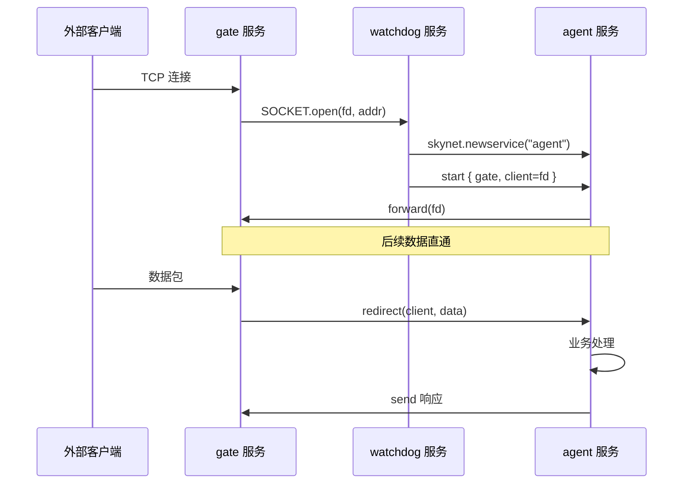

# examples 示例详解

> 示例代码位于 `examples/` 目录下，展示了 Skynet 的典型用法。

## 文件清单

| 文件 | 职责 |
|------|------|
| `config` | ★主配置文件 |
| `config.c1` / `config.c2` | 集群节点 1/2 配置 |
| `main.lua` | ★主服务入口 |
| `watchdog.lua` | ★看门狗服务（连接管理） |
| `agent.lua` | ★代理服务（业务逻辑） |
| `gate.lua` | 网关服务（在 service/ 目录，此处通过 config 加载） |
| `simpledb.lua` | 简单数据库服务 |
| `client.lua` | Lua 客户端 |
| `simpleweb.lua` | HTTP 服务示例 |
| `simplewebsocket.lua` | WebSocket 示例 |
| `simplemonitor.lua` | 监控示例 |
| `proto.lua` | 协议定义 |
| `protoloader.lua` | 协议加载器 |
| `share.lua` | 共享数据示例 |
| `abort.lua` | 异常测试 |
| `checkdeadloop.lua` | 死循环检测测试 |
| `globallog.lua` | 全局日志示例 |
| `userlog.lua` | 用户日志示例 |
| `injectlaunch.lua` | 热更新示例 |
| `preload.lua` | 预加载示例 |
| `cluster1.lua` / `cluster2.lua` | 集群示例 |
| `clustername.lua` | 集群名称示例 |
| `main_mysql.lua` / `main_mongodb.lua` | MySQL / MongoDB 示例 |
| `config.mysql` / `config.mongodb` | 数据库配置示例 |
| `config_log` / `config.path` / `config.userlog` | 日志配置示例 |
| `login/` | 登录服务示例 |

---

## 一、配置系统 (`config`)

### 主配置文件示例

```lua
-- examples/config
root = "./"
thread = 8                       -- worker 线程数
harbor = 1                       -- 节点 ID
start = "main"                   -- 启动的主服务
bootstrap = "snlua bootstrap"    -- 引导程序
logger = nil                     -- 日志文件
logservice = "logger"            -- 默认日志服务
logpath = "."                    -- 日志目录
harbor = 0                       -- 0 = 单节点模式
standalone = "0.0.0.0:2016"     -- 独立模式地址

-- Lua 搜索路径
luaservice = root.."service/?.lua;"..root.."test/?.lua;"..root.."examples/?.lua;"..root.."test/?/init.lua"
lualoader = root.."lualib/loader.lua"
lua_path = root.."lualib/?.lua;"..root.."lualib/?/init.lua"
lua_cpath = root.."luaclib/?.so"

-- C 模块搜索路径
cpath = root.."cservice/?.so"

-- Sproto 协议路径
snax = root.."examples/?.lua;"..root.."test/?.lua"
```

### 集群示例配置 (`config.c1`)

```lua
-- config.c1: 主节点
root = "./"
thread = 1
harbor = 1              -- 节点 ID = 1
start = "cluster1"
standalone = "0.0.0.0:2016"  -- master 地址
```

---

## 二、`main.lua` — 主服务入口

```lua
local skynet = require("skynet")

skynet.start(function()
    skynet.error("Server start")
    
    -- 启动协议加载器（唯一服务）
    skynet.uniqueservice("protoloader")
    
    -- 调试控制台
    if not skynet.getenv("daemon") then
        local console = skynet.newservice("console")
    end
    skynet.newservice("debug_console", 8000)  -- Web 调试端口 8000
    
    -- 简单数据库
    skynet.newservice("simpledb")
    
    -- 启动 watchdog（网关守门员）
    local watchdog = skynet.newservice("watchdog")
    local addr, port = skynet.call(watchdog, "lua", "start", {
        port = 8888,
        maxclient = 64,
        nodelay = true,
    })
    skynet.error("Watchdog listen on " .. addr .. ":" .. port)
    
    skynet.exit()
end)
```

## 三、架构：watchdog → gate → agent

### 典型服务拓扑



### `watchdog.lua` — 看门狗

Watchdog 是连接管理者，负责：

1. 启动 gate 服务监听端口
2. 新连接到来时创建 agent 服务
3. 管理 agent 生命周期
4. 连接断开时通知 agent 退出

```lua
local CMD = {}
local SOCKET = {}
local gate
local agent = {}

function SOCKET.open(fd, addr)
    -- 新客户端连接
    agent[fd] = skynet.newservice("agent")
    skynet.call(agent[fd], "lua", "start", {
        gate = gate,
        client = fd,
        watchdog = skynet.self()
    })
end

function SOCKET.close(fd)
    -- 连接断开
    local a = agent[fd]
    agent[fd] = nil
    if a then
        skynet.call(gate, "lua", "kick", fd)
        skynet.send(a, "lua", "disconnect")
    end
end

function CMD.start(conf)
    return skynet.call(gate, "lua", "open", conf)
end

skynet.start(function()
    skynet.dispatch("lua", function(session, source, cmd, subcmd, ...)
        if cmd == "socket" then
            local f = SOCKET[subcmd]
            f(...)
        else
            local f = assert(CMD[cmd])
            skynet.ret(skynet.pack(f(subcmd, ...)))
        end
    end)
    gate = skynet.newservice("gate")
end)
```

### `agent.lua` — 业务代理

每个客户端连接对应一个 agent 服务：

```lua
local CMD = {}
local REQUEST = {}

function REQUEST:get()
    -- 从 simpledb 查询
    local r = skynet.call("SIMPLEDB", "lua", "get", self.what)
    return { result = r }
end

function REQUEST:set()
    skynet.call("SIMPLEDB", "lua", "set", self.what, self.value)
end

function REQUEST:handshake()
    return { msg = "Welcome to skynet" }
end

function CMD.start(conf)
    local fd = conf.client
    -- 初始化 s proto 协议
    host = sprotoloader.load(1):host("package")
    send_request = host:attach(sprotoloader.load(2))
    
    -- 心跳协程
    skynet.fork(function()
        while true do
            send_package(send_request("heartbeat"))
            skynet.sleep(500)  -- 每 5 秒
        end
    end)
    
    -- 注册到 gate（数据直通）
    skynet.call(gate, "lua", "forward", fd)
end

function CMD.disconnect()
    skynet.exit()
end
```

---

## 四、`simpledb.lua` — 简单数据库

一个基于内存的 key-value 存储服务：

```lua
local db = {}
local CMD = {}

function CMD.get(key)
    return db[key]
end

function CMD.set(key, value)
    local old = db[key]
    db[key] = value
    return old
end

function CMD.del(key)
    db[key] = nil
end

skynet.start(function()
    skynet.dispatch("lua", function(session, source, cmd, ...)
        local f = assert(CMD[cmd])
        skynet.ret(skynet.pack(f(...)))
    end)
end)
```

---

## 五、`client.lua` — Lua 客户端

使用原始 Lua 实现的 TCP 客户端：

```lua
package.cpath = "luaclib/?.so"
package.path = "lualib/?.lua;examples/?.lua"

local socket = require("client.socketdriver")
-- 连接到服务器
local fd = socket.connect("127.0.0.1", 8888)
-- 发送和接收数据...
```

---

## 六、其他示例

### `simpleweb.lua` — HTTP 服务

```lua
local skynet = require("skynet")
local socket = require("skynet.socket")
local httpd = require("http.httpd")
local sockethelper = require("http.sockethelper")

skynet.start(function()
    local address = "0.0.0.0:8001"
    skynet.error("HTTP server listen on", address)
    httpd.start(address, function(id, addr)
        -- 读取 HTTP 请求
        local code, url, method, header, body = httpd.read_request(id, 8192)
        -- 返回响应
        httpd.write_response(id, code, body)
    end)
end)
```

### `simplewebsocket.lua` — WebSocket

```lua
local websocket = require("http.websocket")
-- WebSocket 握手和消息处理
```

### `simplemonitor.lua` — 监控

监听服务启动/退出事件：

```lua
skynet.register_protocol {
    name = "SYSTEM",
    id = skynet.PTYPE_SYSTEM,
    unpack = function(...) end,
    dispatch = function(...) end,
}
```

### `globallog.lua` — 全局日志

通过调用 `skynet.call(".logger", "lua", ...)` 实现全局日志。

### `cluster1.lua` / `cluster2.lua` — 集群

多节点通信示例，通过 `cluster.call()` / `cluster.send()` 进行跨节点调用。

### `main_mysql.lua` / `main_mongodb.lua` — 数据库

MySQL 和 MongoDB 的集成示例。

---

## 七、完整启动流程示例

```
./skynet examples/config

启动顺序：
1. main() → 加载 config → skynet_start()
2. 启动 logger 服务
3. 启动 snlua bootstrap → 执行 bootstrap.lua
4. bootstrap 启动 launcher
5. bootstrap 启动 cdummy/cslave (集群相关)
6. bootstrap 启动 datacenterd (单节点模式)
7. bootstrap 启动 service_mgr
8. bootstrap 启动 main.lua (用户主服务)
9. main.lua 启动 protoloader (uniqueservice)
10. main.lua 启动 console / debug_console
11. main.lua 启动 simpledb
12. main.lua 启动 watchdog
13. watchdog 启动 gate (监听 8888)
14. main.lua 自身 exit()
15. bootstrap 自身 exit()
16. 系统进入运行状态，等待客户端连接
```

当客户端连接时：
```
TCP 连接 → gate → SOCKET.open → watchdog → newservice("agent")
                                                → agent.start()
                                                → gate.forward(fd)
数据 → gate → agent (redirect 直通)
断开 → gate → watchdog → agent.disconnect() → agent.exit()
```

---

## 八、示例中的完整服务通信链

```
Client (Lua 终端)
    ↓ TCP:8888
gate (service/gate.lua)          — 网络层
    ↓ SOCKET.open
watchdog (examples/watchdog.lua) — 连接管理
    ↓ newservice
agent (examples/agent.lua)       — 业务逻辑
    ↓ skynet.call
simpledb (examples/simpledb.lua) — 数据存储

protoloader (examples/protoloader.lua) — 协议管理
console   (service/console.lua)        — 调试控制台
launcher  (service/launcher.lua)       — 服务管理
bootstrap (service/bootstrap.lua)      — 系统引导
```
