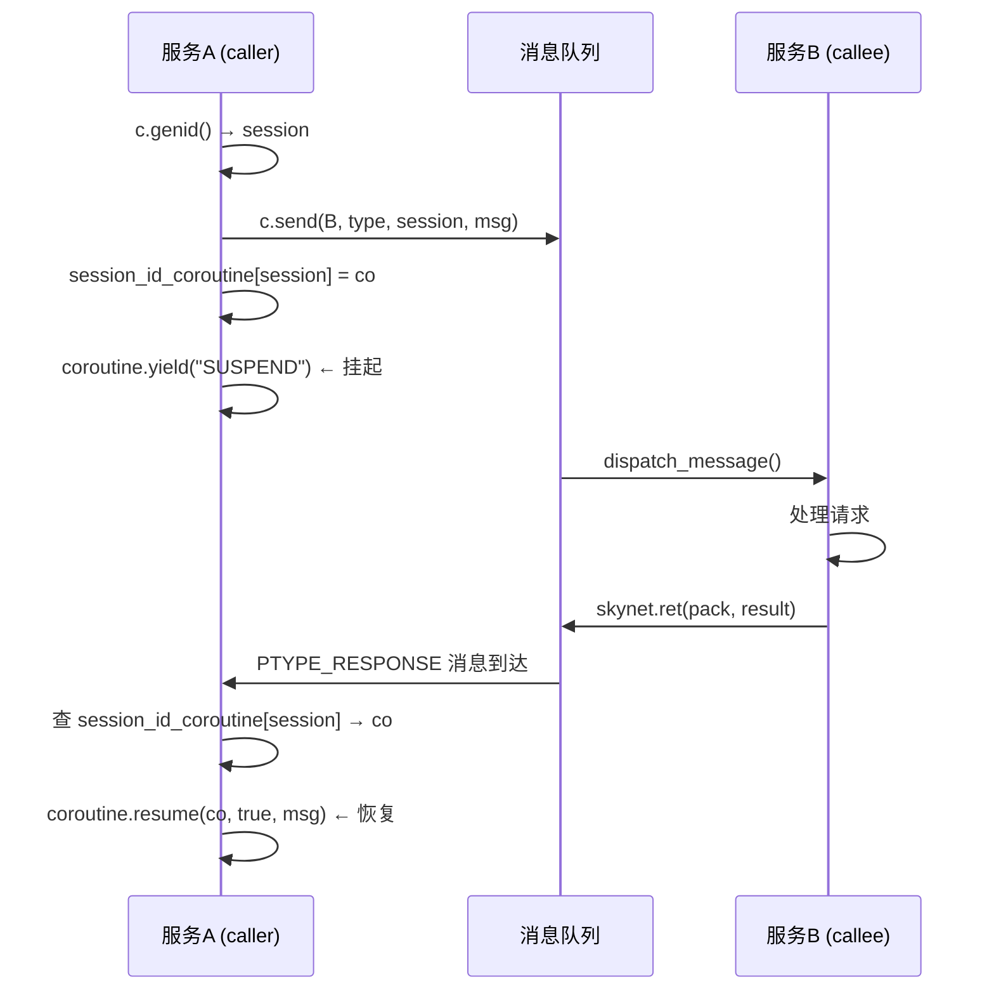

# Lua 虚拟机在 Skynet 中的使用详解

> 本文档面向有一定 Lua 语法基础、但对 Lua 虚拟机（`lua_State`）内部机制不熟悉的读者，结合 skynet 项目实际代码讲解。

---

## 目录

- [一、Lua 虚拟机基础概念速览](#一lua-虚拟机基础概念速览)
  - [1.1 什么是 `lua_State`](#11-什么是-lua_state)
  - [1.2 协程（Coroutine / Lua Thread）](#12-协程coroutine--lua-thread)
  - [1.3 注册表（Registry）](#13-注册表registry)
  - [1.4 自定义内存分配器](#14-自定义内存分配器)
  - [1.5 GC（垃圾回收）](#15-gc垃圾回收)
  - [1.6 Debug Hook（钩子）](#16-debug-hook钩子)
- [二、Skynet 中有三处 `lua_State`](#二skynet-中有三处-lua_state)
  - [2.1 对比表](#21-对比表)
- [三、核心：`service_snlua.c` — Lua 服务宿主](#三核心service_snluac--lua-服务宿主)
  - [3.1 数据结构](#31-数据结构)
  - [3.2 生命周期](#32-生命周期)
  - [3.3 内存管理 — `lalloc()`](#33-内存管理--lalloc)
  - [3.4 协程调度 — `lua_resumeX()`](#34-协程调度--lua_resumex)
  - [3.5 信号/调试支持](#35-信号调试支持)
- [四、`skynet_env.c` — 环境变量的 Lua 存储](#四skynet_envc--环境变量的-lua-存储)
  - [特点](#特点)
  - [为什么用 Lua VM 存环境变量？](#为什么用-lua-vm-存环境变量)
  - [使用方式](#使用方式)
- [五、`main()` 中的临时 Lua 虚拟机](#五main-中的临时-lua-虚拟机)
  - [完整的配置加载流程](#完整的配置加载流程)
  - [`load_config` 脚本](#load_config-脚本)
  - [为什么用完就关？](#为什么用完就关)
- [六、`lua-skynet.c` — C API 绑定（`skynet.core`）](#六lua-skynetc--c-api-绑定skynetcore)
  - [6.1 需要 context 的函数（有 skynet_context 上值）](#61-需要-context-的函数有-skynet_context-上值)
  - [6.2 不需要 context 的函数](#62-不需要-context-的函数)
  - [6.3 `lcallback` — 消息分发桥接](#63-lcallback--消息分发桥接)
- [七、`skynet.lua` — Lua 服务高级 API](#七skynetlua--lua-服务高级-api)
  - [7.1 核心 API 速查](#71-核心-api-速查)
  - [7.2 `skynet.call` 实现原理](#72-skynetcall-实现原理)
  - [7.3 协程池（Coroutine Pool）](#73-协程池coroutine-pool)
- [八、Lua 5.5 修改版](#八lua-55-修改版)
  - [两个核心改动](#两个核心改动)
- [九、协程调度机制总结](#九协程调度机制总结)
- [十、关键文件索引](#十关键文件索引)

---

## 一、Lua 虚拟机基础概念速览

### 1.1 什么是 `lua_State`

```c
lua_State *L = luaL_newstate();   // 创建一个"Lua 虚拟机实例"
```

`lua_State` 代表一个**完全独立的 Lua 运行环境**，包含：
- 全局表 `_G`（存放所有全局变量和函数）
- 注册表 `LUA_REGISTRYINDEX`（C 代码专用的隐蔽存储空间）
- 调用栈（函数调用时压入/弹出）
- 垃圾回收器（GC）状态
- 内存分配器

**关键理解**：多个 `lua_State` 之间完全隔离，互不影响。一个 `lua_State` 里的全局变量，另一个 `lua_State` 看不到。

### 1.2 协程（Coroutine / Lua Thread）

```lua
-- 创建一个协程
local co = coroutine.create(function() ... end)
-- 启动/恢复协程
coroutine.resume(co, args...)
-- 协程内部暂停
coroutine.yield(result...)
```

在 C 层面：
```c
lua_State *co = lua_newthread(L);      // 从主 L 创建协程（共享全局表）
int ret = lua_resume(co, from, nargs); // 恢复协程执行
```

- 协程也是一个 `lua_State *`，但它**共享**主 `lua_State` 的全局表和注册表
- 协程有自己的栈空间，独立于主线程
- **每个 Lua 服务内部可以有多个协程并发执行**（协作式，不是抢占式）

### 1.3 注册表（Registry）

```c
// 注册表是一个 Lua table，只能在 C 代码中访问
// 类似 Lua 中的 debug.getregistry()
lua_pushstring(L, "my_key");
lua_pushlightuserdata(L, ptr);
lua_rawset(L, LUA_REGISTRYINDEX);   // registry["my_key"] = ptr

// 读取
lua_pushstring(L, "my_key");
lua_rawget(L, LUA_REGISTRYINDEX);   // 压入 registry["my_key"]
void *ptr = lua_touserdata(L, -1);
```

注册表是 C 代码在 Lua 中存储数据的**最佳位置**，不会污染全局表 `_G`。

### 1.4 自定义内存分配器

```c
lua_State *L = lua_newstate(my_alloc, my_ud);
// my_alloc(ud, ptr, osize, nsize)
//   nsize == 0: 释放 ptr
//   ptr == NULL: 分配 nsize
//   否则: 重新分配 ptr 到 nsize
```

允许拦截所有 Lua 内存分配，用于：
- 追踪内存使用量
- 设置内存上限
- 自定义内存池

### 1.5 GC（垃圾回收）

```c
lua_gc(L, LUA_GCSTOP, 0);     // 暂停 GC
lua_gc(L, LUA_GCRESTART, 0);  // 恢复 GC
lua_gc(L, LUA_GCGEN, 0, 0);   // 切换到分代模式（skynet 默认）
lua_gc(L, LUA_GCCOLLECT, 0);  // 执行一次完整 GC
```

skynet 使用**分代 GC**：新对象在 young 代，存活一定次数后晋升到 old 代，old 代 GC 频率远低于 young 代，适合服务端长期运行场景。

### 1.6 Debug Hook（钩子）

```c
lua_sethook(L, my_hook, LUA_MASKCOUNT, 1000);
// 每执行 1000 条指令触发 my_hook(L, &ar)
```

用于：
- **断点调试**：在 hook 中暂停/检查程序
- **超时检测**：执行指令数过多时触发
- **信号注入**：skynet 用 hook 向运行中的协程注入 `signal 0`

---

## 二、Skynet 中有三处 `lua_State`

| 位置 | 用途 | 生命周期 |
|------|------|---------|
| **每个 `snlua` 服务** | 运行业务逻辑，每个服务独立一个主 `lua_State` | `skynet_context_new` → `skynet_context_release` |
| **`skynet_env`** | 全局环境变量存储，极简 `luaL_newstate()` | `skynet_env_init()` → 进程退出 |
| **`main()` 临时** | 解析配置文件，用完即关 | `luaL_newstate()` → `lua_close()` |

### 2.1 对比表

| 特性 | 服务 Lua VM | env Lua VM | main 临时 VM |
|------|------------|------------|-------------|
| 创建方式 | `lua_newstate(custom_alloc)` | `luaL_newstate()` | `luaL_newstate()` |
| 加载标准库 | ✅ `luaL_openlibs` | ❌ 只存字符串 | ✅ `luaL_openlibs` |
| 自定义分配器 | ✅ 带内存限制 | ❌ 默认 malloc | ❌ 默认 malloc |
| 协程 | ✅ 多个 | ❌ 无 | ❌ 无 |
| GC 模式 | 分代 GC | 默认 | 默认 |
| 线程安全 | 每个 worker 线程一个服务 | spinlock 保护 | 主线程独占 |

---

## 三、核心：`service_snlua.c` — Lua 服务宿主

`snlua` 是 skynet 最重要的 C 服务，每个 `snlua` 实例**内嵌一个完整的 Lua 虚拟机**，承载所有 Lua 业务逻辑。

### 3.1 数据结构

```c
struct snlua {
    lua_State * L;          // 主 lua_State
    struct skynet_context * ctx;  // 关联的 skynet context
    size_t mem;             // 当前内存用量
    size_t mem_report;      // 下次报告内存警告的阈值
    size_t mem_limit;       // 内存硬上限（0 = 不限制）
    lua_State * activeL;    // 当前活跃的协程
    ATOM_INT trap;          // 信号陷阱（0=无, 1=设置中, -1=已设置）
};
```

### 3.2 生命周期

```
skynet_context_new("snlua", args)
    │
    ├─ snlua_create()
    │   └─ lua_newstate(lalloc, l, seed)  ← 用自定义分配器创建 lua_State
    │
    ├─ snlua_init()
    │   └─ skynet_callback(ctx, L, launch_cb)
    │   └─ 向自己发送第一条消息（触发 init_cb）
    │
    ├─ init_cb() （收到第一条消息时调用）
    │   ├─ lua_gc(L, LUA_GCSTOP)          ← 暂停 GC
    │   ├─ luaL_openlibs(L)               ← 加载 Lua 标准库
    │   ├─ 替换 coroutine.resume/wrap      ← 注入性能统计
    │   ├─ 注册 skynet.core C 模块
    │   ├─ 设置 package.path / cpath        ← 从环境变量读取
    │   ├─ lua_gc(L, LUA_GCGEN)           ← 切换到分代 GC
    │   ├─ luaL_loadfile + lua_pcall       ← 加载并执行用户服务代码
    │   └─ lua_gc(L, LUA_GCRESTART)       ← 恢复 GC
    │
    ├─ _cb() （每次收到消息时调用）
    │   └─ lua_pcall(cb_ctx->L, 5, 0)     ← 在协程中执行消息处理函数
    │
    └─ snlua_release()
        └─ lua_close(L)                    ← 销毁 lua_State
```

### 3.3 内存管理 — `lalloc()`

```c
static void *lalloc(void *ud, void *ptr, size_t osize, size_t nsize) {
    struct snlua *l = ud;
    l->mem += nsize - osize;              // 追踪内存用量
    if (nsize > osize && l->mem_limit > 0 && l->mem > l->mem_limit)
        return NULL;                       // 超出硬限制，拒绝分配
    if (l->mem > l->mem_report) {
        l->mem_report *= 2;               // 翻倍阈值
        skynet_error(l->ctx, "memory warning: %zu", l->mem);
    }
    return skynet_lalloc(ptr, osize, nsize);
}
```

关键设计：
- **硬限制**：超过 `mem_limit` 时 Lua 会触发内存错误而非 OOM
- **渐进式告警**：阈值从 32MB 起，每次触发翻倍（32M → 64M → 128M → ...）
- `mem_limit` 可在 Lua 代码中动态设置：`skynet.memlimit(256 * 1024 * 1024)`

### 3.4 协程调度 — `lua_resumeX()`

```c
static int lua_resumeX(lua_State *L, lua_State *from, int nargs, int *nresults) {
    struct snlua *l = get_snlua(from);
    switchL(L, l);                         // 切换 activeL，检查是否有待处理的 trap
    int err = lua_resume(L, from, nargs, nresults);
    // 恢复后检查 trap 是否在 resume 期间被设置
    if (ATOM_LOAD(&l->trap)) { /* 等待 hook 完成 */ }
    switchL(from, l);                      // 恢复 activeL
    return err;
}
```

这是 skynet 在 `lua_resume` 外的一层薄封装，主要增加：
1. **追踪当前活跃协程**（`activeL`）
2. **支持信号注入**（trap 机制，用于 `debug_console` 打断点）

### 3.5 信号/调试支持

```c
snlua_signal(ctx, signal) {
    case 0:  // 打断当前协程
        ATOM_STORE(&l->trap, 1);
        // 如果 activeL 存在，安装 hook
        lua_sethook(l->activeL, signal_hook, LUA_MASKCOUNT, 1);
        break;
    case 1:  // 报告内存用量
        skynet_error(ctx, "memory: %zu", l->mem);
        break;
}
```

- Signal 0: 下一字节码执行前触发 `signal_hook` → 抛出 `luaL_error("signal 0")` → 中断协程
- 用于 `debug_console` 的 **break** 功能

---

## 四、`skynet_env.c` — 环境变量的 Lua 存储

```c
struct skynet_env {
    struct spinlock lock;
    lua_State *L;    // 极简 lua_State，只存字符串
};
```

### 特点

- 用 `luaL_newstate()` 创建，**不加载任何标准库**
- 环境变量存为 Lua 全局变量（`lua_setglobal` / `lua_getglobal`）
- **一次写入不可修改**：`skynet_setenv` 要求 key 不存在才写入
- 线程安全自旋锁保护

### 为什么用 Lua VM 存环境变量？

直接用 HashTable 当然也可以，但 Lua VM 提供：
- 内置哈希表（全局表 `_G` 就是）
- 自动内存管理（不需要写释放逻辑）
- 统一的字符串存储

### 使用方式

```c
// 写
skynet_setenv("thread", "8");
// 读
const char *val = skynet_getenv("thread");  // → "8"
```

```lua
-- Lua 侧通过 skynet.getenv 访问
local n = skynet.getenv("thread")
```

---

## 五、`main()` 中的临时 Lua 虚拟机

### 完整的配置加载流程

```
main()
  │
  ├─ luaL_newstate()          ← 创建临时 lua_State
  ├─ luaL_openlibs(L)         ← 加载标准库（需要 io、os 等来解析配置）
  ├─ luaL_loadbufferx(L, load_config, ...)  ← 编译内嵌配置脚本
  │   └─ 栈: [编译好的函数]
  ├─ lua_pushstring(L, config_file)         ← 压入参数
  │   └─ 栈: [函数][配置文件名]
  ├─ lua_pcall(L, 1, 1, 0)   ← 执行，1 个参数，1 个返回值
  │   └─ 栈: [配置 table]
  ├─ _init_env(L)             ← 遍历配置 table，逐项拷到 skynet_env
  │   └─ 栈: [配置 table]
  └─ lua_close(L)             ← 数据已搬完，销毁虚拟机
```

### `load_config` 脚本

这个脚本**硬编码在 C 代码中**（`skynet_main.c` 第 89-112 行），支持：
- 环境变量替换（`$VARNAME` → `os.getenv("VARNAME")`）
- 文件包含（`include("filename")`）
- Lua 原生语法定义配置

### 为什么用完就关？

`_init_env()` 已经把配置 table 中所有 key-value 拷到了 C 层的 `skynet_env`。后续代码通过 `skynet_getenv()` 读配置，不需要这个 Lua 虚拟机了。

---

## 六、`lua-skynet.c` — C API 绑定（`skynet.core`）

这个模块给 Lua 层提供了访问 skynet 底层能力的 C 函数。在 `skynet.lua` 中通过 `local c = require "skynet.core"` 引入。

### 6.1 需要 context 的函数（有 skynet_context 上值）

| Lua 函数 | C 函数 | 功能 |
|----------|--------|------|
| `c.send(addr, type, session, msg, sz)` | `lsend` | 发送消息 |
| `c.genid()` | `lgenid` | 分配 session ID |
| `c.command(cmd, param)` | `lcommand` | 执行 ADMIN 命令 |
| `c.addresscommand(cmd)` | `laddresscommand` | 返回 hex 地址 |
| `c.callback(dispatch_func)` | `lcallback` | ★注册消息回调 |
| `c.error(...)` | `lerror` | 输出错误日志 |
| `c.harbor(msg)` | `lharbor` | 获取 harbor 信息 |

### 6.2 不需要 context 的函数

| Lua 函数 | C 函数 | 功能 |
|----------|--------|------|
| `c.pack(...)` | `luaseri_pack` | 序列化为二进制 |
| `c.unpack(msg, sz)` | `luaseri_unpack` | 反序列化 |
| `c.tostring(msg, sz)` | `ltostring` | lightuserdata → Lua string |
| `c.now()` | `lnow` | 获取当前时间（10ms 精度） |
| `c.hpc()` | `lhpc` | 高精度计数器（纳秒） |

### 6.3 `lcallback` — 消息分发桥接

```c
static int lcallback(lua_State *L) {
    // L 栈顶: 用户提供的 dispatch 函数
    struct skynet_context *ctx = get_context(L);  // 从注册表获取
    struct callback_context *cb_ctx = malloc(...);

    cb_ctx->L = lua_newthread(L);  // ★创建新协程
    lua_pushcfunction(cb_ctx->L, traceback);
    lua_xmove(L, cb_ctx->L, 1);    // 将用户函数移动到协程中

    skynet_callback(ctx, cb_ctx, _cb);  // 注册 _cb 为 skynet 回调
    return 0;
}
```

消息到达时：
```
_cb(ctx, cb_ud, type, session, source, msg, sz)
  → 在 cb_ctx->L 协程中:
     压入: function, type, msg, sz, session, source
     lua_pcall(L, 5, 0, traceback)  ← 执行用户 dispatch 函数
```

---

## 七、`skynet.lua` — Lua 服务高级 API

### 7.1 核心 API 速查

| API | 说明 |
|-----|------|
| `skynet.start(func)` | 注册启动函数，框架就绪后调用 |
| `skynet.dispatch(type, func)` | 注册某类型消息的处理函数 |
| `skynet.send(addr, type, ...)` | 异步发送消息（fire-and-forget） |
| `skynet.call(addr, type, ...)` | ★同步 RPC 调用（发送 + 协程暂停等待回复） |
| `skynet.ret(pack, ...)` | 回复 RPC 调用者 |
| `skynet.fork(func, ...)` | 创建协程执行 func（当前消息处理完后） |
| `skynet.sleep(ti)` | 协程休眠 ti × 10ms |
| `skynet.wait(token)` | 协程暂停，等待 `skynet.wakeup(token)` |
| `skynet.wakeup(token)` | 唤醒等待 token 的协程 |
| `skynet.timeout(ti, func)` | ti × 10ms 后执行 func |
| `skynet.exit()` | 优雅退出当前服务 |
| `skynet.newservice(name, ...)` | 创建新服务 |
| `skynet.self()` | 获取当前服务 handle |
| `skynet.getenv(key)` | 获取环境变量 |
| `skynet.profile.start/stop()` | 协程 CPU 计时 |

### 7.2 `skynet.call` 实现原理



### 7.3 协程池（Coroutine Pool）

`skynet.fork` 和消息分发都使用 **协程池** 来减少 `coroutine.create` 的开销：

```lua
local coroutine_pool = setmetatable({}, { __mode = "kv" })

local function co_create(f)
    local co = table.remove(coroutine_pool)
    if co == nil then
        co = coroutine.create(function(...)
            f(...)           -- 执行传入的函数
            while true do
                f = nil
                coroutine_pool[#coroutine_pool + 1] = co  -- 回池
                f = coroutine_yield("SUSPEND")  -- 等待下一个任务
                f(coroutine_yield(...))
            end
        end)
    else
        coroutine.resume(co, f)
    end
    return co
end
```

这个模式：
- 协程执行完一个 `f` 后不销毁，而是回到池中等待下一个任务
- `fork` 队列保证多个 fork 按序执行
- `wakeup` 队列处理被 `skynet.wakeup` 唤醒的协程

---

## 八、Lua 5.5 修改版

skynet 使用的是**修改过的 Lua 5.5**（位于 `3rd/lua/`）。

### 两个核心改动

#### 8.1 共享 Proto（`LUA_CACHELIB`）

**问题**：100 个服务加载同一个 Lua 模块 → 100 份相同的已编译字节码 → 浪费内存

**方案**：多 `lua_State` 之间共享 `Proto`（编译后的函数原型）

```
正常 Lua:  每个 lua_State → 独立 Proto → 独立 GC 管理
共享 Proto: 全局缓存 table → 一份 Proto → 多 lua_State 引用
```

```c
// 相关 API:
const void *lua_sharefunction(L, idx);    // 标记函数可共享，返回 key
void lua_clonefunction(L, key);           // 从共享 key 克隆函数到当前 L
```

使用条件编译 `-DLUA_CACHELIB` 启用，对应文件底部的 `codecache` 模块和 `luaL_loadfilex` 重写。

#### 8.2 共享短字符串

优化短字符串的 interning 机制，在多 state 场景下减少重复字符串的内存开销。

---

## 九、协程调度机制总结

```
Worker 线程循环:
  │
  ├─ skynet_context_message_dispatch(sm, q, weight)
  │   ├─ 从全局队列取服务
  │   ├─ 从服务队列取消息
  │   └─ dispatch_message(ctx, msg)
  │       ├─ pthread_setspecific(handle_key, ctx->handle)  ← TLS 设当前 handle
  │       └─ ctx->cb(...)                                   ← 调用服务回调
  │           └─ _cb(cb_ctx, type, session, source, msg, sz)
  │               └─ lua_pcall(cb_ctx->L, 5, 0, traceback)
  │                   └─ 用户 dispatch 函数（在协程中运行）
  │                       ├─ skynet.call() → 发送 + yield
  │                       ├─ skynet.fork() → 入 fork 队列
  │                       └─ skynet.wait() → 挂起等待
  │               └─ suspend() 处理协程输出:
  │                   ├─ "SUSPEND" → 处理 fork_queue, wakeup_queue
  │                   ├─ "QUIT" → 关闭协程
  │                   └─ 错误 → 发送 PTYPE_ERROR
  │
  └─ 取下一个服务，循环...
```

**关键点**：
- 一个 worker 线程同一时刻只运行**一个协程**
- 协程通过 `yield` 主动让出 CPU（协作式调度）
- fork 的协程在当前消息**完全处理完后**才执行
- RPC call 的回复到达时，框架自动 resume 等待中的协程

---

## 十、关键文件索引

| 文件 | 内容 |
|------|------|
| `service-src/service_snlua.c` | Lua 服务宿主，lua_State 的创建/初始化/销毁 |
| `lualib-src/lua-skynet.c` | `skynet.core` C 模块，底层 API 绑定 |
| `lualib/skynet.lua` | Lua 服务高级 API，协程调度 |
| `skynet-src/skynet_env.c` | 环境变量 Lua VM |
| `skynet-src/skynet_main.c` | `main()` 入口，临时配置解析 Lua VM |
| `skynet-src/skynet_server.c` | Context 管理，`skynet_current_handle()` TLS |
| `service/bootstrap.lua` | 启动引导 Lua 服务 |
| `lualib/loader.lua` | 每个 Lua 服务的入口加载器 |
| `3rd/lua/lauxlib.c` | 包含 skynet 的 codecache 修改 |
