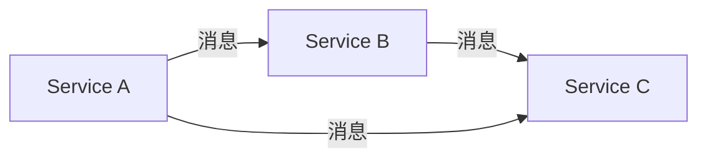
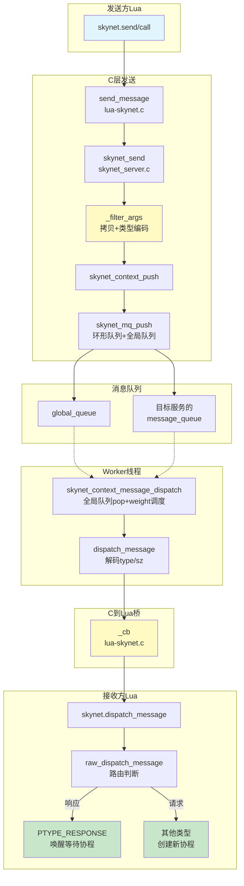
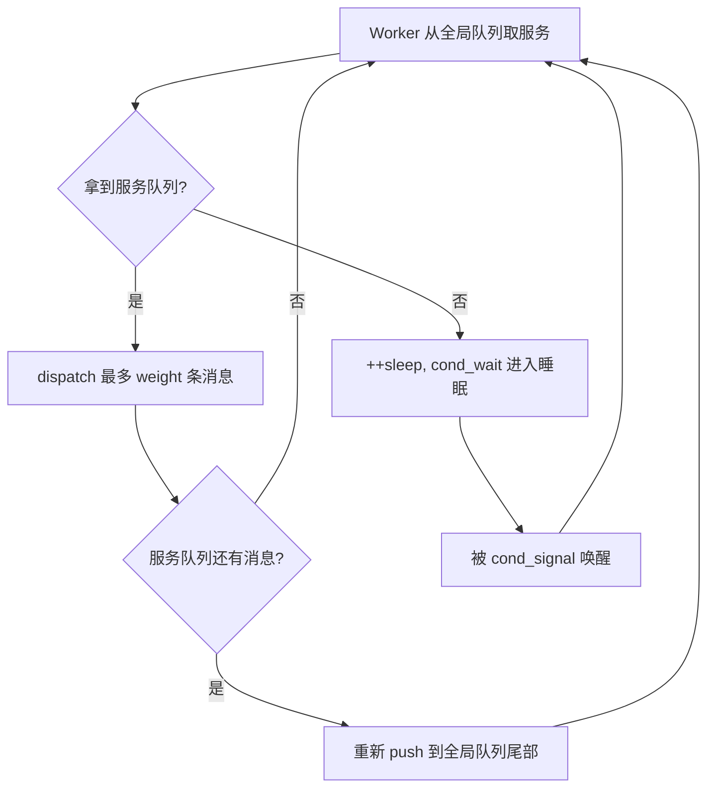
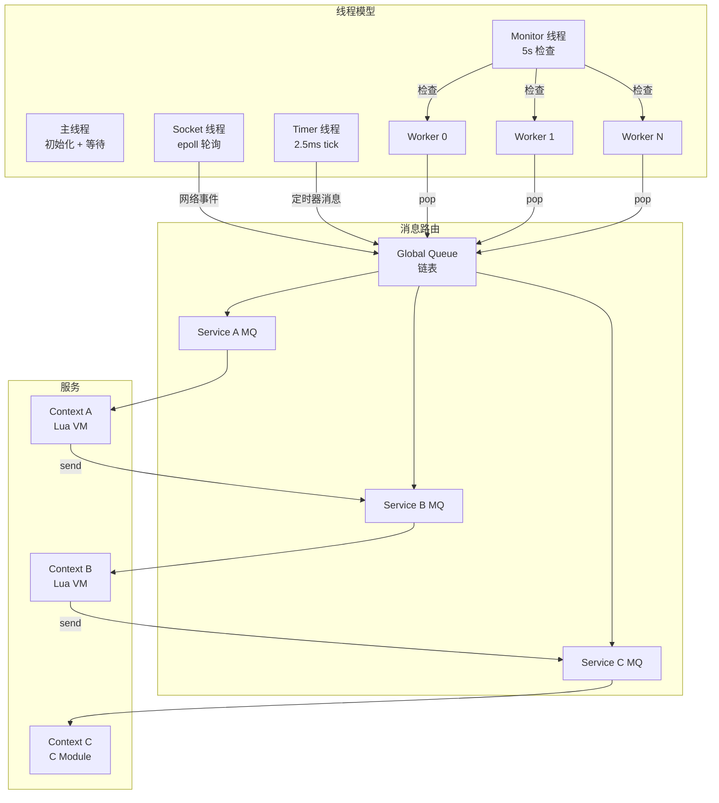
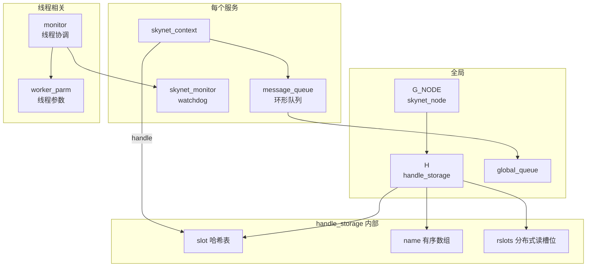

# Skynet 关键概念详解

> 本文档深入解释 Skynet 框架中所有核心概念，适合在阅读源码前建立全局认知。

---

## 目录

- [一、Actor 模型与 Service（Context）](#一actor-模型与-servicecontext)
  - [1.1 Actor 模型](#11-actor-模型)
  - [1.2 Service 生命周期](#12-service-生命周期)
  - [1.3 服务的两种形态](#13-服务的两种形态)
- [二、Handle — 32 位服务地址](#二handle--32-位服务地址)
- [三、消息（Message）与消息队列（Message Queue）](#三消息message与消息队列message-queue)
  - [3.1 消息结构体](#31-消息结构体)
  - [3.2 消息类型 (PTYPE)](#32-消息类型-ptype)
  - [3.3 服务消息队列（环形缓冲区）](#33-服务消息队列环形缓冲区)
  - [3.4 全局消息队列（Global Queue）](#34-全局消息队列global-queue)
  - [3.5 消息类型编码机制](#35-消息类型编码机制)
  - [3.6 消息发送全流程](#36-消息发送全流程)
  - [3.7 消息接收与分发全流程](#37-消息接收与分发全流程)
  - [3.8 完整端到端流程图](#38-完整端到端流程图)
- [四、Worker 线程与消息调度](#四worker-线程与消息调度)
  - [4.1 四类线程](#41-四类线程)
  - [4.2 调度权重（Weight）](#42-调度权重weight)
  - [4.3 Worker 睡眠/唤醒机制](#43-worker-睡眠唤醒机制)
- [五、Harbor — 集群节点通信](#五harbor--集群节点通信)
  - [5.1 什么是 Harbor？](#51-什么是-harbor)
  - [5.2 集群的物理结构](#52-集群的物理结构)
  - [5.3 节点内部结构](#53-节点内部结构)
  - [5.4 Harbor 的值含义](#54-harbor-的值含义)
  - [5.5 本地 vs 远程判断](#55-本地-vs-远程判断)
  - [5.6 远程消息完整发送路径](#56-远程消息完整发送路径)
  - [5.7 Harbor 服务的二进制协议](#57-harbor-服务的二进制协议)
  - [5.8 全局名称服务](#58-全局名称服务)
  - [5.9 集群配置示例](#59-集群配置示例)
- [六、线程局部存储（TLS）与 handle_key](#六线程局部存储tls与-handle_key)
  - [6.1 设计目的](#61-设计目的)
  - [6.2 值的含义](#62-值的含义)
  - [6.3 设置时机](#63-设置时机)
  - [6.4 使用场景](#64-使用场景)
- [七、自旋锁（Spinlock）与读写锁（RWLock）](#七自旋锁spinlock与读写锁rwlock)
  - [7.1 自旋锁](#71-自旋锁)
  - [7.2 读写锁（Handle 存储专用）](#72-读写锁handle-存储专用)
- [八、Module 系统 — C 服务动态加载](#八module-系统--c-服务动态加载)
  - [8.1 加载流程](#81-加载流程)
  - [8.2 服务创建](#82-服务创建)
- [九、定时器 — 多级时间轮](#九定时器--多级时间轮)
  - [9.1 数据结构](#91-数据结构)
  - [9.2 工作原理](#92-工作原理)
  - [9.3 定时器消息](#93-定时器消息)
- [十、Session — RPC 调用/响应配对](#十session--rpc-调用响应配对)
  - [10.1 概念](#101-概念)
  - [10.2 Session vs PTYPE](#102-session-vs-ptype)
- [十一、Monitor — 死循环检测](#十一monitor--死循环检测)
  - [11.1 工作原理](#111-工作原理)
  - [11.2 为什么不用超时？](#112-为什么不用超时)
- [十二、Profile — 性能分析](#十二profile--性能分析)
- [十三、数据流全景图](#十三数据流全景图)
- [十四、核心数据结构详解](#十四核心数据结构详解)
  - [14.1 全局节点 — `skynet_node`（`skynet_server.c`）](#141-全局节点--skynet_nodeskynet_serverc)
  - [14.2 服务上下文 — `skynet_context`（`skynet_server.c`）](#142-服务上下文--skynet_contextskynet_serverc)
  - [14.3 Handle 管理器 — `handle_storage`（`skynet_handle.c`）](#143-handle-管理器--handle_storageskynet_handlec)
  - [14.4 分布式读槽位 — `handle_reader_slot`（`skynet_handle.c`）](#144-分布式读槽位--handle_reader_slotskynet_handlec)
  - [14.5 消息结构体 — `skynet_message`（`skynet_mq.h`）](#145-消息结构体--skynet_messageskynet_mqh)
  - [14.6 服务消息队列 — `message_queue`（`skynet_mq.c`）](#146-服务消息队列--message_queueskynet_mqc)
  - [14.7 全局队列 — `global_queue`（`skynet_mq.c`）](#147-全局队列--global_queueskynet_mqc)
  - [14.8 线程监控器 — `monitor`（`skynet_start.c`）](#148-线程监控器--monitorskynet_startc)
  - [14.9 Worker 参数 — `worker_parm`（`skynet_start.c`）](#149-worker-参数--worker_parmskynet_startc)
  - [14.10 Watchdog — `skynet_monitor`（`skynet_monitor.c`）](#1410-watchdog--skynet_monitorskynet_monitorc)
  - [14.11 启动配置 — `skynet_config`（`skynet_imp.h`）](#1411-启动配置--skynet_configskynet_imph)
  - [14.12 Handle 名字映射 — `handle_name`（`skynet_handle.c`）](#1412-handle-名字映射--handle_nameskynet_handlec)
  - [14.13 数据结构关系总图](#1413-数据结构关系总图)
- [十五、概念速查表](#十五概念速查表)

---

## 一、Actor 模型与 Service（Context）

### 1.1 Actor 模型

Skynet 的并发模型基于 **Actor 模型**：



- 每个 Actor（在 Skynet 中叫 **Service** 或 **Context**）是独立的执行单元
- Actor 之间**不共享内存**，只通过**发送消息**通信
- 每个 Actor 串行处理自己的消息，**天然无锁**，不需要考虑并发竞争
- 一个 Actor 同时只能被一个 Worker 线程处理

### 1.2 Service 生命周期

```
skynet_context_new(name, param)
    ├── 通过 module 系统查找/加载 C 服务 .so 文件
    ├── 创建 skynet_context 结构体
    ├── 创建消息队列 (message_queue)
    ├── 向 handle 系统注册，获得 32 位 handle
    ├── 调用 module->init()  → 初始化
    └── 返回 handle

运行时:
    ├── skynet_context_push() → 向该服务发送消息（推入其消息队列）
    ├── skynet_context_message_dispatch() → Worker 取出消息并执行回调
    └── skynet_context_release() → 引用计数 -1

销毁:
    skynet_handle_retire(handle)
        ├── 从 handle 哈希表移除
        ├── 清空消息队列（调用 drop 回调丢弃消息）
        └── skynet_context_release() → 引用计数归零后释放内存
```

### 1.3 服务的两种形态

| 类型 | 实现 | 说明 |
|------|------|------|
| **C 服务** | `service-src/*.c`，编译为 `.so` | 直接注册 C 回调函数，适合高性能场景 |
| **Lua 服务** | `service/*.lua`，由 `snlua` 托管 | 业务逻辑使用 Lua 编写，`snlua` 作为一个 C 服务为每个 Lua 服务创建独立的 Lua VM |

> 关键文件: `skynet_server.c`, `service-src/service_snlua.c`

---

## 二、Handle — 32 位服务地址

```
┌─────────────────────┬────────────────────────────┐
│   高 8 位 (harbor)   │     低 24 位 (handle index) │
│   节点标识           │     节点内唯一 ID            │
└─────────────────────┴────────────────────────────┘
 bit 31            24  bit 23                      0
```

- **harbor**：集群节点标识，范围 0~255。harbor=0 表示本节点
- **handle index**：节点内自增编号，最多 16,777,215 个服务（0 保留给系统）
- 宏定义：`HANDLE_MASK = 0xffffff`，`HANDLE_REMOTE_SHIFT = 24`

```c
// 判断一个 handle 是否为远程节点
int h = (handle & ~HANDLE_MASK);  // 取高 8 位
return h != HARBOR && h != 0;     // 既不是本地也不是 0 → 远程
```

> 关键文件: `skynet_handle.h`, `skynet_handle.c`, `skynet_harbor.c`

---

## 三、消息（Message）与消息队列（Message Queue）

### 3.1 消息结构体

```c
struct skynet_message {
    uint32_t source;   // 发送方 handle
    int session;       // 会话 ID（用于 RPC call/response 配对）
    void * data;       // 消息体指针
    size_t sz;         // 消息体大小 + 高 8 位存储消息类型 (PTYPE_*)
};
```

消息类型编码在 `sz` 的高 8 位（跨平台兼容 `sizeof(size_t)` 不同的情况）：

```c
#define MESSAGE_TYPE_MASK  (SIZE_MAX >> 8)
#define MESSAGE_TYPE_SHIFT ((sizeof(size_t)-1) * 8)
```

### 3.2 消息类型 (PTYPE)

| 类型 | 值 | 用途 |
|------|-----|------|
| `PTYPE_TEXT` | 0 | 普通文本消息（Lua 默认） |
| `PTYPE_RESPONSE` | 1 | RPC 响应 / 定时器回调 |
| `PTYPE_MULTICAST` | 2 | 多播消息 |
| `PTYPE_CLIENT` | 3 | 客户端消息 |
| `PTYPE_SYSTEM` | 4 | 系统消息（如 SIGHUP 日志重开） |
| `PTYPE_HARBOR` | 5 | 集群间通信 |
| `PTYPE_SOCKET` | 6 | Socket 事件通知 |
| `PTYPE_ERROR` | 7 | 错误消息 |

> 关键文件: `skynet.h`, `skynet_mq.h`

### 3.3 服务消息队列（环形缓冲区）

每个服务拥有独立的消息队列，使用**环形缓冲区**（circular buffer）实现：

```c
struct message_queue {
    struct spinlock lock;           // 自旋锁保护并发访问
    uint32_t handle;                // 所属服务的 handle
    int cap;                        // 队列容量（初始 64，不足时 ×2 扩容）
    int head;                       // 读指针
    int tail;                       // 写指针
    int release;                    // 标记是否正在释放
    int in_global;                  // 是否已在全局队列中
    int overload;                   // 过载标记（长度超过阈值时触发）
    int overload_threshold;         // 过载阈值（初始 1024）
    struct skynet_message *queue;   // 消息数组
    struct message_queue *next;     // 全局队列链表指针
};
```

**写入**（`skynet_mq_push`）：tail 位置写入后 tail++，head == tail 时自动扩容  
**读取**（`skynet_mq_pop`）：head 位置读取后 head++，队列空时 `in_global=0`  
**过载检测**：当队列长度 > `overload_threshold`，记录 overload 标记并将阈值翻倍

### 3.4 全局消息队列（Global Queue）

全局队列是一个**单向链表**，链接所有有消息待处理的服务队列：

```c
struct global_queue {
    struct message_queue *head;   // 链表头
    struct message_queue *tail;   // 链表尾（快速追加）
    struct spinlock lock;          // 全局锁
};
```

**工作流程：**

```
1. 服务 A 收到消息 → push 到 A 的队列 → 如果 A 不在全局队列中，追加到尾部
2. Worker 线程 → pop 全局队列头部 → 拿到一个服务队列
3. Worker 处理该服务队列中的消息（最多 weight 条）
4. 如果该服务队列还有剩余消息 → 重新 push 回全局队列尾部
```

> 关键文件: `skynet_mq.c`, `skynet_mq.h`

---

### 3.5 消息类型编码机制

消息类型（`PTYPE_*`）并非存储在独立的字段中，而是**编码进 `sz` 字段的高 8 位**，实现零额外内存开销：

```
size_t sz (64-bit 系统):
┌──────────────────────┬──────────────────────────────────────────┐
│   高 8 位: 消息类型   │   低 56 位: 实际数据长度                   │
│   (type << 56)       │   (sz & 0x00FFFFFFFFFFFFFF)               │
└──────────────────────┴──────────────────────────────────────────┘

size_t sz (32-bit 系统):
┌──────────────────────┬──────────────────────────────────────────┐
│   高 8 位: 消息类型   │   低 24 位: 实际数据长度                   │
│   (type << 24)       │   (sz & 0x00FFFFFF)                       │
└──────────────────────┴──────────────────────────────────────────┘
```

```c
// skynet_mq.h — 跨平台兼容的宏
#define MESSAGE_TYPE_MASK  (SIZE_MAX >> 8)
// 64-bit: 0x00FFFFFFFFFFFFFF, 32-bit: 0x00FFFFFF

#define MESSAGE_TYPE_SHIFT ((sizeof(size_t)-1) * 8)
// 64-bit: 56, 32-bit: 24

// 编码（发送时）：
sz |= (size_t)type << MESSAGE_TYPE_SHIFT;

// 解码（接收时）：
type = msg->sz >> MESSAGE_TYPE_SHIFT;   // 提取类型
len  = msg->sz & MESSAGE_TYPE_MASK;     // 提取长度
```

> 关键文件: `skynet_mq.h`

---

### 3.6 消息发送全流程

从 Lua 层 `skynet.send` 到最终推入目标服务消息队列的完整链路：

#### 3.6.1 Lua 层入口

```lua
-- skynet.lua — Lua 层的 send/call 最终都调用 c.send
function skynet.send(addr, typename, msg, sz, session)
    local p = proto[typename]
    return c.send(addr, p.id, session, msg, sz)
end
```

- `addr`：目标服务 handle（数字）或名称（字符串，会自动查找转换）
- `p.id`：协议类型 ID（如 `PTYPE_LUA = 10`）
- `session`：`nil` 时自动分配（`PTYPE_TAG_ALLOCSESSION`）

#### 3.6.2 C 层 `send_message`（lua-skynet.c）

```c
// lua-skynet.c — c.send 的 C 绑定
static int send_message(lua_State *L, int source, int idx_type) {
    uint32_t dest = (uint32_t)lua_tointeger(L, 1);
    if (dest == 0) {
        // dest 为 0 且传入了名字字符串 → 按名字查找 handle
        dest_string = get_dest_string(L, 1);
    }
    int type = luaL_checkinteger(L, idx_type + 0);

    // session 为 nil → 自动分配
    if (lua_isnil(L, idx_type + 1)) {
        type |= PTYPE_TAG_ALLOCSESSION;
    }

    // 添加 TAG 标记
    if (msg 是 lightuserdata) → type |= PTYPE_TAG_DONTCOPY（零拷贝）
    else                      → 正常模式（拷贝数据）

    skynet_send(context, source, dest, type, session, msg, sz);
}
```

**两个关键 TAG：**

| TAG | 值 | 含义 |
|-----|-----|------|
| `PTYPE_TAG_DONTCOPY` | `0x10000` | 不拷贝数据，直接传递指针（零拷贝，调用方负责不释放） |
| `PTYPE_TAG_ALLOCSESSION` | `0x20000` | 自动分配一个新的 session ID（用于 RPC call） |

#### 3.6.3 `skynet_send`（skynet_server.c）

```c
// skynet_server.c — 核心发送函数
int skynet_send(ctx, source, dest, type, session, data, sz) {
    // ① 检查消息体大小（不能超过 MESSAGE_TYPE_MASK）
    if ((sz & MESSAGE_TYPE_MASK) != sz) {
        return -2;  // 消息过大
    }

    // ② 过滤参数：拷贝数据 + 编码类型
    _filter_args(context, type, &session, &data, &sz);

    if (source == 0) source = context->handle;

    // ③ dest == 0：只分配 session，不发送（genid 用法）
    if (destination == 0) {
        return session;
    }

    // ④ 判断是否远程消息
    if (skynet_harbor_message_isremote(destination)) {
        // → 走 harbor TCP 通道（见第五节）
        struct remote_message * rmsg = ...;
        skynet_harbor_send(rmsg, source, session);
    } else {
        // ⑤ 本地消息：组装 skynet_message 推入目标队列
        struct skynet_message smsg;
        smsg.source  = source;
        smsg.session = session;
        smsg.data    = data;
        smsg.sz      = sz;       // sz 已编码类型

        if (skynet_context_push(destination, &smsg)) {
            skynet_free(data);   // 目标不存在，释放数据
            return -1;
        }
    }
    return session;  // 返回 session id
}
```

#### 3.6.4 `_filter_args` — 消息预处理

```c
// skynet_server.c — 消息发送前的参数处理
static void _filter_args(ctx, type, *session, **data, *sz) {
    int needcopy    = !(type & PTYPE_TAG_DONTCOPY);   // 是否需要拷贝
    int allocsession = type & PTYPE_TAG_ALLOCSESSION;  // 是否自动分配 session
    type &= 0xff;   // 剥离 TAG，只保留纯类型（低 8 位）

    if (allocsession) {
        *session = skynet_context_newsession(context);
    }
    if (needcopy && *data) {
        // 深拷贝：防止调用方释放数据后消息内容失效
        char * msg = skynet_malloc(*sz + 1);
        memcpy(msg, *data, *sz);
        msg[*sz] = '\0';
        *data = msg;
    }
    // 编码：将类型写入 sz 高位
    *sz |= (size_t)type << MESSAGE_TYPE_SHIFT;
}
```

**为什么需要拷贝？** Lua 的 string / lightuserdata 可能在 `skynet.send` 返回后被 GC 回收，拷贝确保消息数据在目标服务的整个生命周期内有效。

#### 3.6.5 `skynet_context_push` → `skynet_mq_push`

```c
// ① 通过 handle 获取 context（带引用计数保护）
int skynet_context_push(uint32_t handle, struct skynet_message *msg) {
    struct skynet_context * ctx = skynet_handle_grab(handle);  // ref +1
    if (ctx == NULL) return -1;   // 服务已销毁
    skynet_mq_push(ctx->queue, msg);
    skynet_context_release(ctx);  // ref -1
    return 0;
}

// ② 推入服务的环形消息队列
void skynet_mq_push(struct message_queue *q, struct skynet_message *msg) {
    SPIN_LOCK(q)
    q->queue[q->tail] = *msg;           // 写入环形缓冲区
    if (++q->tail >= q->cap) q->tail = 0;  // 尾指针前移
    if (q->head == q->tail) {
        expand_queue(q);                // 队列满 → 扩容至 2 倍
    }
    if (q->in_global == 0) {
        q->in_global = MQ_IN_GLOBAL;    // 标记已在全局队列
        skynet_globalmq_push(q);        // 加入全局队列尾部
    }
    SPIN_UNLOCK(q)
}
```

#### 3.6.6 发送流程小结

```
Lua: skynet.send(addr, type, msg)
  │
  ▼
C:   send_message()        — TAG 处理 + 名字解析
  │
  ▼
C:   skynet_send()         — 路由判断（本地/远程）
  │
  ├── 远程 → skynet_harbor_send() → TCP 发送
  │
  └── 本地 ↓
C:   _filter_args()        — 拷贝数据 + 类型编码进 sz
  │
  ▼
C:   skynet_context_push() — handle → context 查找
  │
  ▼
C:   skynet_mq_push()      — 写入环形队列 → 加入全局队列
  │
  ▼
     [等待 Worker 线程取出]
```

> 关键文件: `skynet_server.c` (send/context_push), `skynet_mq.c` (mq_push), `lualib-src/lua-skynet.c` (send_message), `lualib/skynet.lua` (send)

---

### 3.7 消息接收与分发全流程

从 Worker 线程取消息到 Lua 服务回调执行的完整链路：

#### 3.7.1 Worker 线程主循环（skynet_start.c）

```c
// skynet_start.c — 每个 worker 线程的入口
static void * thread_worker(void *p) {
    struct worker_parm *wp = p;
    int weight = wp->weight;               // 调度权重
    struct message_queue * q = NULL;       // 当前正在处理的服务队列

    while (!m->quit) {
        q = skynet_context_message_dispatch(sm, q, weight);
        if (q == NULL) {
            // 全局队列为空 → 进入条件变量睡眠
            pthread_mutex_lock(&m->mutex);
            ++m->sleep;
            if (!m->quit) pthread_cond_wait(&m->cond, &m->mutex);
            --m->sleep;
            pthread_mutex_unlock(&m->mutex);
        }
    }
}
```

**关键：** `q` 在循环中保持，传给下一次 `dispatch`。如果上次的队列还有消息，不必重新从全局队列取。

#### 3.7.2 `skynet_context_message_dispatch`（skynet_server.c）

这是 Worker 线程的**核心调度函数**，流程如下：

```c
struct message_queue *
skynet_context_message_dispatch(sm, q, weight) {
    // ── 步骤 1：获取服务队列 ──
    if (q == NULL) {
        q = skynet_globalmq_pop();   // 从全局队列头部取出
        if (q == NULL) return NULL;   // 全局队列为空
    }

    // ── 步骤 2：获取服务上下文 ──
    uint32_t handle = skynet_mq_handle(q);
    struct skynet_context * ctx = skynet_handle_grab(handle);
    if (ctx == NULL) {
        // 服务已销毁 → 丢弃该队列所有消息 → 取下一个
        skynet_mq_release(q, drop_message, &d);
        return skynet_globalmq_pop();
    }

    // ── 步骤 3：处理消息（最多 n 条） ──
    int i, n = 1;
    struct skynet_message msg;

    for (i = 0; i < n; i++) {
        if (skynet_mq_pop(q, &msg)) {       // 队列空
            skynet_context_release(ctx);
            return skynet_globalmq_pop();    // 取下一个服务
        }

        // 首次 pop 后，根据 weight 计算本次批处理数量
        if (i == 0 && weight >= 0) {
            n = skynet_mq_length(q);
            n >>= weight;    // weight=0→全部, 1→一半, 2→1/4, 3→1/8
        }

        // 过载检测
        int overload = skynet_mq_overload(q);

        // 调用回调分发消息（核心！）
        dispatch_message(ctx, &msg);
    }

    // ── 步骤 4：公平调度 ──
    struct message_queue *nq = skynet_globalmq_pop();
    if (nq) {
        skynet_globalmq_push(q);  // 当前队列放回队尾（还有消息）
        q = nq;                     // 处理下一个服务
    }
    // 否则 nq == NULL：继续处理当前 q（可能还有新消息）
    skynet_context_release(ctx);
    return q;
}
```

**Weight 调度机制：**

```
weight = -1 → 处理队列中全部消息（不限量）
weight =  0 → n = length / 1  ≈ 全部
weight =  1 → n = length / 2  ≈ 一半
weight =  2 → n = length / 4  ≈ 1/4
weight =  3 → n = length / 8  ≈ 1/8
```

weight 越大，每次处理的批次数越小，将剩余消息放回全局队列尾部，让其他服务也有机会被执行。

#### 3.7.3 `dispatch_message` — C 层消息分发（skynet_server.c）

```c
// skynet_server.c — 将消息解码后调用服务的回调函数
static void dispatch_message(ctx, msg) {
    // ① 从 sz 中解码类型和实际长度
    int type = msg->sz >> MESSAGE_TYPE_SHIFT;    // 提取类型
    size_t sz = msg->sz & MESSAGE_TYPE_MASK;     // 提取长度

    // ② 设置 TLS 为当前服务的 handle
    pthread_setspecific(handle_key, (void*)(uintptr_t)ctx->handle);

    // ③ 日志输出（如果配置了）
    if (ctx->logfile) {
        skynet_log_output(f, msg->source, type, msg->session, msg->data, sz);
    }

    // ④ 调用服务的回调函数
    ++ctx->message_count;
    if (ctx->profile) {
        ctx->cpu_start = skynet_thread_time();
        reserve_msg = ctx->cb(ctx, ctx->cb_ud, type, msg->session,
                              msg->source, msg->data, sz);
        ctx->cpu_cost += skynet_thread_time() - ctx->cpu_start;
    } else {
        reserve_msg = ctx->cb(ctx, ctx->cb_ud, type, msg->session,
                              msg->source, msg->data, sz);
    }

    // ⑤ 回调返回 0 → 框架释放 msg->data
    //    回调返回 1 → 数据由服务自己管理（如 forward 模式）
    if (!reserve_msg) {
        skynet_free(msg->data);
    }
}
```

**回调签名：**

```c
typedef int (*skynet_cb)(struct skynet_context * context,
    void *ud, int type, int session, uint32_t source,
    const void * msg, size_t sz);
//   返回 0：框架负责 free(msg)
//   返回非0：服务自己管理 msg 内存
```

#### 3.7.4 C → Lua 回调桥（lua-skynet.c）

对于 Lua 服务（由 `snlua` 托管），`ctx->cb` 指向 `_cb` 函数：

```c
// lua-skynet.c — 将 C 层的消息参数推入 Lua 栈并调用 Lua 函数
static int
_cb(struct skynet_context * context, void * ud, int type, int session,
    uint32_t source, const void * msg, size_t sz) {
    lua_State *L = cb_ctx->L;

    lua_pushvalue(L, 2);                     // push dispatch_message 函数
    lua_pushinteger(L, type);                 // arg1: prototype（消息类型）
    lua_pushlightuserdata(L, (void *)msg);    // arg2: msg（数据指针）
    lua_pushinteger(L, sz);                   // arg3: sz（数据长度）
    lua_pushinteger(L, session);              // arg4: session
    lua_pushinteger(L, source);              // arg5: source（发送方 handle）

    int r = lua_pcall(L, 5, 0, trace);       // 调用 Lua 函数
    return 0;  // 返回 0，框架释放 msg->data
}
```

**C → Lua 参数映射：**

| C 层函数参数 | Lua 栈位置 | Lua 变量名 | 含义 |
|-------------|-----------|-----------|------|
| `type` | arg1 | `prototype` | 消息类型（PTYPE_*） |
| `msg` | arg2 | `msg` | 消息体指针（lightuserdata） |
| `sz` | arg3 | `sz` | 消息体长度 |
| `session` | arg4 | `session` | 会话 ID |
| `source` | arg5 | `source` | 发送方 handle |

**注册时机（首次回调先经过 `_cb_pre`）：**

```c
// lcallback — 首次回调用 _cb_pre（清理旧上下文），之后用 _cb
static int _cb_pre(...) {
    clear_last_context(cb_ctx->L);
    skynet_callback(context, cb_ctx, _cb);  // 替换为 _cb
    return _cb(context, ud, ...);
}
```

#### 3.7.5 Lua 层 `skynet.dispatch_message`（skynet.lua）

```lua
-- 在 skynet.start 中注册
function skynet.start(start_func)
    c.callback(skynet.dispatch_message)  -- 注册为 C 层回调的目标函数
    skynet.timeout(0, function()
        skynet.init_service(start_func)
    end)
end

-- 入口：处理 C 层传来的 5 个参数
function skynet.dispatch_message(...)
    local succ, err = pcall(raw_dispatch_message, ...)
    -- 处理 fork_queue 中的所有协程
    while true do
        local co = fork_queue[h]
        if co == nil then break end
        fork_queue[h] = nil
        local fork_succ, fork_err = pcall(suspend, co, coroutine_resume(co))
        ...
    end
    assert(succ, tostring(err))
end
```

**执行模型：** 每处理一条外部消息后，顺序执行 `fork_queue` 中的所有 fork 协程。这意味着 `skynet.fork()` 创建的协程会在**当前消息处理周期内**执行完毕。

#### 3.7.6 `raw_dispatch_message` — 消息路由（skynet.lua）

```lua
local function raw_dispatch_message(prototype, msg, sz, session, source)
    if prototype == PTYPE_RESPONSE then  -- ① 响应消息
        local co = session_id_coroutine[session]
        if co == nil then
            unknown_response(session, source, msg, sz)
        else
            session_id_coroutine[session] = nil
            -- 唤醒等待该响应的协程
            suspend(co, coroutine_resume(co, true, msg, sz, session))
        end
    else  -- ② 普通请求消息
        local p = proto[prototype]
        if p == nil then
            -- 未知协议 → 发 PTYPE_ERROR 回复
            return
        end
        local f = p.dispatch
        if f then
            -- 创建新协程执行服务逻辑
            local co = co_create(f)
            session_coroutine_id[co] = session
            session_coroutine_address[co] = source
            -- unpack 反序列化消息 → 调用 dispatch
            suspend(co, coroutine_resume(co, session, source, p.unpack(msg, sz)))
        end
    end
end
```

**两种消息的处理路径：**

| 消息类型 | 路由方式 | 说明 |
|----------|---------|------|
| `PTYPE_RESPONSE` | `session_id_coroutine[session]` 查找 | 找到 `skynet.call` 挂起的协程，`resume` 唤醒它 |
| 其他类型 | `proto[prototype].dispatch` | 创建**新协程**，`unpack` 反序列化后执行业务逻辑 |

**协议注册（`skynet.lua` 内置）：**

```lua
-- "lua" 协议：使用 pack/unpack 序列化
REG { name = "lua", id = PTYPE_LUA, pack = skynet.pack, unpack = skynet.unpack }

-- "response" 协议：不需要 pack/unpack
REG { name = "response", id = PTYPE_RESPONSE }

-- "error" 协议：错误处理
REG { name = "error", id = PTYPE_ERROR, dispatch = _error_dispatch }
```

服务代码中通过 `skynet.dispatch("lua", handler)` 设置自己的 `.dispatch` 函数：

```lua
skynet.dispatch("lua", function(session, source, cmd, ...)
    -- cmd = 第一个参数（通常是命令名）
    --     = unpack 反序列化后的第一个值
end)
```

#### 3.7.7 接收流程小结

```
[Worker Thread]
  │
  ▼
skynet_context_message_dispatch(sm, q, weight)
  │
  ├── ① skynet_globalmq_pop()     → 从全局队列取一个服务队列
  ├── ② skynet_handle_grab()      → 获取服务上下文
  ├── ③ skynet_mq_pop()           → 从环形队列取一条消息
  │
  ▼
dispatch_message(ctx, &msg)
  │
  ├── 解码: type = sz >> 56, len = sz & MASK
  ├── TLS:  设为 ctx->handle
  └── 调用: ctx->cb(ctx, ud, type, session, source, data, len)
       │
       ▼
  [_cb in lua-skynet.c]
       │
       ├── lua_pushinteger(L, type)         → prototype
       ├── lua_pushlightuserdata(L, msg)    → msg
       ├── lua_pushinteger(L, sz)           → sz
       ├── lua_pushinteger(L, session)      → session
       ├── lua_pushinteger(L, source)       → source
       └── lua_pcall → skynet.dispatch_message(prototype, msg, sz, session, source)
            │
            ▼
       [raw_dispatch_message in skynet.lua]
            │
            ├── PTYPE_RESPONSE? → 查找等待协程 → coroutine_resume 唤醒
            │
            └── 其他类型 → proto[prototype].dispatch → 创建新协程
                          → unpack 反序列化 → 执行业务逻辑
```

---

### 3.8 完整端到端流程图



**数据转换总结：**

| 阶段 | 数据形态 | 类型存储方式 |
|------|---------|-------------|
| Lua `skynet.send` | `(addr, proto_name, msg, sz)` | `proto_name` 转为 `p.id` |
| C `send_message` | `(dest, type, session, msg, sz)` | `type` 含 TAG 标记 |
| C `_filter_args` | 拷贝数据，剥离 TAG | `type &= 0xff`，编码进 `sz` 高位 |
| `skynet_message` | `{source, session, data, sz}` | `sz` = `len | (type << 56)` |
| `dispatch_message` | 解码 `sz` | `type = sz >> 56`, `len = sz & MASK` |
| C `_cb` → Lua | `(prototype, msg, sz, session, source)` | `prototype` = 解码后的纯 type |
| Lua `raw_dispatch` | 根据 `prototype` 路由 | 匹配 `proto[prototype]` |

> 关键文件: `skynet_server.c` (dispatch_message/context_message_dispatch), `skynet_mq.c` (mq_pop), `skynet_start.c` (thread_worker), `lualib-src/lua-skynet.c` (_cb), `lualib/skynet.lua` (raw_dispatch_message/dispatch_message)

---

## 四、Worker 线程与消息调度

### 4.1 四类线程

| 线程类型 | 枚举值 | TLS 标记 | 职责 |
|----------|--------|----------|------|
| **Worker** | `THREAD_WORKER` (0) | `0x00000000` | 核心消息调度，从全局队列取服务处理消息 |
| **Main** | `THREAD_MAIN` (1) | `0xFFFFFFFF` | 主线程，初始化后等待线程退出 |
| **Socket** | `THREAD_SOCKET` (2) | `0xFFFFFFFE` | 网络 I/O 事件轮询（epoll/kqueue） |
| **Timer** | `THREAD_TIMER` (3) | `0xFFFFFFFD` | 驱动时间更新 + SIGHUP 处理 |
| **Monitor** | `THREAD_MONITOR` (4) | `0xFFFFFFFC` | 检测 worker 死循环 |

每个线程启动时调用 `skynet_initthread(type)` 将线程类型（负数）存入 TLS。

### 4.2 调度权重（Weight）

Worker 线程有调度权重，控制一次从服务队列中最多取出多少条消息：

```
weight 数组（前 32 个 worker）：
[-1, -1, -1, -1,  0,0,0,0,  1,1,1,1,1,1,1,1,  2,2,2,2,2,2,2,2,  3,3,3,3,3,3,3,3]
```

- **weight = -1**：处理队列中所有消息，直到队列为空
- **weight = 0/1/2/3**：每次最多处理相应条数的消息，剩余消息重新回全局队列尾部
- 超过 32 个线程时，多余线程 weight 为 0

### 4.3 Worker 睡眠/唤醒机制



```c
// 唤醒条件：睡眠线程数 >= 总线程数 - 繁忙线程数
static void wakeup(struct monitor *m, int busy) {
    if (m->sleep >= m->count - busy) {
        pthread_cond_signal(&m->cond);
    }
}
```

> 关键文件: `skynet_start.c`

---

## 五、Harbor — 集群节点通信

### 5.1 什么是 Harbor？

**Harbor** 是 Skynet 中**节点（进程）的唯一标识**，是一个 0~255 的整数。每个 skynet 进程在配置文件中指定自己的 harbor id：

```lua
-- config 示例
harbor = 1    -- 当前进程的 harbor id 是 1
```

它的作用是把 32 位 handle 的高 8 位用作「节点号」，从而在一个集群中唯一标识每个服务：

```
   handle = 0x 01 000001
             ↑    ↑
          harbor  handle_index (低 24 位)
```

- **harbor = 0**：特殊值，表示「本节点内部」或「未指定远端」
- **同一 harbor 的两个 handle**：属于同一个 skynet 进程（同一台机器的同一个进程）
- **不同 harbor 的两个 handle**：属于不同的 skynet 进程（可能分布在多台物理机上）

---

### 5.2 集群的物理结构

一个典型的多节点 Skynet 集群部署如下：

```
┌──────────────────────────────────────────────────────────────────┐
│                         Skynet 集群                               │
│                                                                   │
│  ┌─────────────────────┐    ┌─────────────────────┐              │
│  │  进程 A (harbor=1)   │    │  进程 B (harbor=2)   │              │
│  │  127.0.0.1:2526     │    │  127.0.0.1:2527     │              │
│  │                     │    │                     │              │
│  │  Logger  Service    │    │  Logger  Service    │              │
│  │  Gate    Service    │    │  Agent  Service     │              │
│  │  SDB    Service     │    │  Ping   Service     │              │
│  │  ...                │    │  ...                │              │
│  │                     │    │                     │              │
│  │  harbor 服务 (C)    │◄──►│  harbor 服务 (C)   │              │
│  │  (TCP 长连接)       │    │  (TCP 长连接)       │              │
│  └─────────────────────┘    └─────────────────────┘              │
│           │                           │                           │
│           │         ┌─────────────────────┐                      │
│           └────────►│  进程 C (harbor=3)   │                      │
│                     │  127.0.0.1:2528     │                      │
│                     │  ...                │                      │
│                     └─────────────────────┘                      │
└──────────────────────────────────────────────────────────────────┘
```

**关键点**：
- 每个进程是一个**节点**，进程之间是**对等关系**（无中心节点）
- 节点之间通过 **TCP 长连接**通信，由 harbor 服务（`service-src/service_harbor.c`）管理
- 每个 harbor 进程可以同时连接多个远程 harbor（最多 `REMOTE_MAX = 256` 个）
- 服务之间的消息发送**对节点透明**——Lua 层调用 `skynet.send(handle, ...)` 时，框架自动判断 handle 是本地还是远程，自动走本地队列或 TCP 通道

---

### 5.3 节点内部结构

每个 skynet 进程（节点）内部有两层 harbor 抽象：

```
┌──────────────────────────────────────────────────┐
│              一个 skynet 节点 (harbor=1)           │
│                                                   │
│  ┌─────────────────────────────────────────────┐ │
│  │        C 层：skynet_harbor.c                 │ │
│  │  HARBOR = 0x01000000  (全局变量)             │ │
│  │  REMOTE → harbor C 服务的 context            │ │
│  │  职责：判断消息是否远程，转发到 harbor 服务    │ │
│  └─────────────────────────────────────────────┘ │
│                      │                            │
│                      ▼                            │
│  ┌─────────────────────────────────────────────┐ │
│  │     C 层：service_harbor.c (harbor 服务)      │ │
│  │  struct harbor {                             │ │
│  │    id = 1  (本节点 harbor id)                 │ │
│  │    slave → clusterd 服务 handle               │ │
│  │    map  → 全局名称 → handle 哈希表             │ │
│  │    s[256] → 每个远程节点的 TCP 连接状态        │ │
│  │  }                                           │ │
│  │  职责：                                       │ │
│  │  - 管理到其他节点的 TCP 连接（握手/收发）      │ │
│  │  - 将远程消息封装为二进制协议包发送             │ │
│  │  - 接收远程消息并转发给本地服务                 │ │
│  └─────────────────────────────────────────────┘ │
│                      │                            │
│                      ▼                            │
│  ┌─────────────────────────────────────────────┐ │
│  │    Lua 层：clusterd.lua (集群守护服务)        │ │
│  │  职责：                                       │ │
│  │  - 管理 cluster 配置文件（节点名→地址映射）    │ │
│  │  - 动态注册/注销全局名称 (register/unregister) │ │
│  │  - 创建 clustersender / clusteragent          │ │
│  │  - 接收新节点的 TCP 连接，创建 clusteragent    │ │
│  └─────────────────────────────────────────────┘ │
│                      │                            │
│         ┌────────────┼────────────┐              │
│         ▼            ▼            ▼              │
│  ┌──────────┐ ┌──────────┐ ┌──────────┐        │
│  │cluster   │ │cluster   │ │cluster   │        │
│  │sender    │ │sender    │ │agent     │        │
│  │→ 节点2   │ │→ 节点3   │ │← 节点2   │        │
│  └──────────┘ └──────────┘ └──────────┘        │
│                                                   │
│  ┌─────────────────────────────────────────────┐ │
│  │  业务服务 (Lua)                               │ │
│  │  cluster.call("db", "@sdb", "GET", "a")      │ │
│  │  cluster.send("db2", "@sdb", "PING")         │ │
│  └─────────────────────────────────────────────┘ │
└──────────────────────────────────────────────────┘
```

---

### 5.4 Harbor 的值含义

| harbor 值 | 含义 |
|-----------|------|
| `0` | 本节点内部地址，或未指定远端。handle 高 8 位为 0 表示本地服务 |
| `1~255` | 集群中的节点编号。每个 skynet 进程在 config 中指定唯一的 harbor |

**编码存储**：Harbor 被左移 24 位后存入 `HARBOR` 全局变量和每个 handle 的高 8 位：

```c
// 初始化
HARBOR = (unsigned int)harbor << HANDLE_REMOTE_SHIFT;
// 例：harbor=1 → HARBOR = 0x01000000

// 注册 handle 时，将 harbor 编码进去
handle |= s->harbor;
// 例：handle_index=5, harbor=1 → handle = 0x01000005
```

---

### 5.5 本地 vs 远程判断

```c
// skynet_harbor.c
int skynet_harbor_message_isremote(uint32_t handle) {
    int h = (handle & ~HANDLE_MASK);  // 取高 8 位
    return h != HARBOR && h != 0;     // 不是本节点 → 远程
}
```

判断逻辑：
- `h == HARBOR` → 本节点内服务，走本地消息队列
- `h == 0` → 未指定 harbor（如定时器消息 source=0），本地处理
- 其他 → **远程节点**，需要走 TCP 通道

---

### 5.6 远程消息完整发送路径

```
Lua: cluster.call("db", "@sdb", "GET", "a")
  │
  ▼
Lua: clusterd.lua 查找 "db" → 127.0.0.1:2528
  │
  ▼
Lua: clustersender.lua → packrequest() 将消息序列化为二进制协议包
  │
  ▼
Lua: socketchannel → 通过 TCP fd 发送
  │
  ▼  (网络传输)
  │
  ▼
远程节点: harbor C 服务接收 TCP 数据
  │
  ├── STATUS_HANDSHAKE → 验证远程 harbor id
  ├── STATUS_HEADER    → 解析 12 字节头 (source/destination/session)
  ├── STATUS_CONTENT   → 读取消息体
  │
  ▼
forward_local_messsage():
  将 destination 的 harbor 部分替换为本节点 harbor
  → skynet_send() 发给本地目标服务
```

---

### 5.7 Harbor 服务的二进制协议

节点间通信使用自定义的二进制协议，每个包格式：

```
┌──────────────────────────────────────────────────────┐
│ 4 字节 (big-endian): 包总长度 (header + body + cookie) │
├──────────────────────────────────────────────────────┤
│                    消息体 (body)                       │
├──────────────────────────────────────────────────────┤
│ 12 字节 Cookie (big-endian):                          │
│   4 字节: source handle                               │
│   4 字节: destination handle                          │
│   4 字节: session                                     │
└──────────────────────────────────────────────────────┘
```

---

### 5.8 全局名称服务

每个节点的 harbor 服务维护一个**全局名称 → handle 的映射表**（哈希表 `struct hashmap`），支持：

- **N 命令**：更新名称映射（`N name handle`）
- **Q 命令**：查询名称（收到未知名称时向 clusterd 查询）

在 Lua 层，通过 `cluster.register("sdb", handle)` 注册全局名称，其他节点可以跨节点通过名字找到服务：

```lua
-- 节点 1: 注册全局名
cluster.register("sdb", sdb_handle)

-- 节点 2: 通过名字调用节点 1 的服务
local proxy = cluster.proxy("db@sdb")
skynet.call(proxy, "lua", "GET", "a")
```

---

### 5.9 集群配置示例

**节点 1 配置** (`config.node1`)：
```lua
harbor = 1
address = "127.0.0.1:2526"
master = "127.0.0.1:2013"
```

**节点 2 配置** (`config.node2`)：
```lua
harbor = 2
address = "127.0.0.1:2527"
master = "127.0.0.1:2013"
```

**集群拓扑配置** (`clustername.lua`，所有节点共享)：
```lua
db  = "127.0.0.1:2528"   -- 节点名 db，监听 2528
db2 = "127.0.0.1:2529"   -- 节点名 db2，监听 2529
```

---

> 关键文件:
> - C 层: `skynet_harbor.c`, `skynet_harbor.h`, `service-src/service_harbor.c`
> - Lua 层: `service/clusterd.lua`, `service/clustersender.lua`, `service/clusteragent.lua`, `service/clusterproxy.lua`
> - 协议: `lualib-src/lua-cluster.c`
> - 示例: `examples/cluster1.lua`, `examples/cluster2.lua`, `examples/clustername.lua`

---

## 六、线程局部存储（TLS）与 handle_key

### 6.1 设计目的

Skynet 使用 `pthread_key_t`（`G_NODE.handle_key`）在每个线程的 TLS 中存储不同的值，用于标识**当前执行上下文**。

### 6.2 值的含义

| TLS 值 | 含义 |
|--------|------|
| **正数**（如 0x01000001） | 正在某个服务的 context 中执行回调 |
| **负数**（如 0xFFFFFFFE） | 在框架线程中（Socket/Timer/Monitor/Main） |
| **Worker 执行中** | 先设为服务 handle（正数），执行完回调后恢复 |

### 6.3 设置时机

```c
// 框架线程初始化时 → 设为负数
skynet_initthread(THREAD_SOCKET);  // TLS = 0xFFFFFFFE

// 分发消息给服务时 → 设为服务 handle（正数）
pthread_setspecific(G_NODE.handle_key, (void *)(uintptr_t)(ctx->handle));
// ... 执行服务回调 ...
// 回调结束后无需恢复，下一次 dispatch 会覆盖
```

### 6.4 使用场景

```c
// skynet_error 中：判断是否可以 dispatch
void *handle = pthread_getspecific(G_NODE.handle_key);
// 负数 → 框架线程，不能安全 dispatch 消息
// 正数 → 在某个服务上下文中
```

> 关键文件: `skynet_server.c`, `skynet_imp.h`

---

## 七、自旋锁（Spinlock）与读写锁（RWLock）

### 7.1 自旋锁

```c
struct spinlock {
    atomic_flag_ lock;  // 原子标志位
};

// 加锁：忙等待（自旋），适合临界区极短的场景
static inline void spinlock_lock(struct spinlock *lock) {
    while (atomic_flag_test_and_set_(&lock->lock)) {}
}
```

**使用位置**：
- 消息队列的锁（`message_queue.lock`）：保护 queue 的 head/tail
- 全局队列的锁（`global_queue.lock`）：保护全局链表的 head/tail
- 定时器的锁（`timer.lock`）：保护时间轮

**为什么用自旋锁而非 mutex？**  
临界区非常短（通常几条指令），自旋等待的开销远小于 mutex 的上下文切换。

### 7.2 读写锁（Handle 存储专用）

```c
struct rwlock {
    int write;        // 写锁标志
    int read;         // 读锁计数
};
```

Handle 存储使用读写锁的**分布式优化版**——每个线程有自己的读槽位（`handle_reader_slot`），读操作只设置自己槽位的 active 标志，避免多线程竞争同一个全局锁。

```c
// 读锁：只设置本线程槽位
ATOM_STORE(&s->rslots[TLS_SLOT_IDX].active, 1);

// 写锁：等待所有槽位都没有活跃读者
for (int i = 0; i < s->rslot_count; i++) {
    while (ATOM_LOAD(&s->rslots[i].active)) { atomic_pause_(); }
}
```

> 关键文件: `spinlock.h`, `rwlock.h`, `skynet_handle.c`

---

## 八、Module 系统 — C 服务动态加载

### 8.1 加载流程

```c
struct skynet_module {
    const char * name;   // 模块名（如 "snlua"）
    void * module;       // dlopen 返回的句柄
    // 三个函数指针，由 .so 导出
    void * (*create)(void);                           // 创建实例
    int    (*init)(void * inst, struct skynet_context *, const char * parm);  // 初始化
    void   (*release)(void * inst);                   // 释放实例
};
```

```c
// 查找模块流程
skynet_module_query("snlua")
    ├── 先在已加载的模块链表中查找
    ├── 未找到 → dlopen("./cservice/snlua.so")
    ├── dlsym 获取 create/init/release 三个符号
    └── 加入模块链表缓存
```

### 8.2 服务创建

```c
skynet_context_new("snlua", "bootstrap")
    ├── skynet_module_query("snlua") → 获取 module
    ├── 创建 skynet_context 和 message_queue
    ├── skynet_handle_register() → 分配 handle
    ├── module->create() → 创建模块实例（snlua 创建 Lua VM）
    ├── module->init(inst, ctx, "bootstrap") → 初始化（加载 bootstrap.lua）
    └── skynet_mq_push() → 将服务推入全局队列
```

> 关键文件: `skynet_module.c`, `skynet_module.h`

---

## 九、定时器 — 多级时间轮

### 9.1 数据结构

```
near[256]  →  精度 1 tick，覆盖 0~255 tick
t[0][64]   →  精度 256 tick
t[1][64]   →  精度 256×64 tick
t[2][64]   →  精度 256×64² tick
t[3][64]   →  精度 256×64³ tick
```

### 9.2 工作原理

- **tick** 由 Timer 线程每 2.5ms 推进一次（`skynet_updatetime()`）
- 新定时器根据 `expire` 与当前 `time` 的差值，找到合适的层级插入链表
- 每 tick 从 `near[current_time & 255]` 取出到期的定时器，发送 `PTYPE_RESPONSE` 消息给对应服务
- 当 `near` 遍历完一轮（256 tick），从 `t[0]` 降级一批到 `near`，以此类推

### 9.3 定时器消息

定时器到期后通过消息队列发送给目标服务，而非直接回调：

```c
struct skynet_message msg;
msg.source = 0;
msg.session = timer_session;   // 定时器创建时分配的 session
msg.data = NULL;
msg.sz = (size_t)PTYPE_RESPONSE << MESSAGE_TYPE_SHIFT;
skynet_context_push(handle, &msg);
```

> 关键文件: `skynet_timer.c`, `skynet_timer.h`

---

## 十、Session — RPC 调用/响应配对

### 10.1 概念

Session 是一个整数 ID，用于关联**请求**和**响应**。当服务 A 向服务 B 发起 RPC 调用（`skynet.call`）时：

```
1. A 分配一个新的 session ID（如 42）
2. 发送消息给 B，消息中携带 session=42
3. A 挂起当前 Lua 协程，等待 session=42 的响应
4. B 处理完后发送 PTYPE_RESPONSE 消息，session=42
5. A 收到后根据 session=42 唤醒对应协程
```

### 10.2 Session vs PTYPE

- `PTYPE_RESPONSE`：消息类型标记，表示这是一条响应消息
- `session`：会话 ID，用于在多个并发请求中匹配具体的响应

> 相关文件: `skynet_server.c`（C 层 session 管理）, `lualib/skynet.lua`（Lua 层 `skynet.call` / `skynet.ret`）

---

## 十一、Monitor — 死循环检测

### 11.1 工作原理

每个 Worker 线程绑定一个 `skynet_monitor`（watchdog）：

```c
struct skynet_monitor {
    int version;       // 版本号
    int check_version; // 上次检查时的版本号
    uint32_t source;   // 当前执行的源 handle
    uint32_t destination; // 当前执行的目标 handle
};
```

- Worker 每处理一条消息，`version++`
- Monitor 线程每 5 秒检查一次：如果 `version == check_version`（说明这 5 秒内没处理任何消息），表示可能**死循环**或**卡死**
- 检测到卡死后，打印 `source` 和 `destination`，帮助定位

### 11.2 为什么不用超时？

因为 Actor 模型下每个服务是串行执行的，一个消息处理时间过长是正常的。Monitor 检测的是"完全卡死"（5 秒内一条消息都没处理完），不是"处理太慢"。

> 关键文件: `skynet_monitor.c`, `skynet_monitor.h`

---

## 十二、Profile — 性能分析

通过编译宏 `SKYNET_PROFILE` 控制。开启后，每个服务记录：

- 消息处理耗时
- CPU 时间消耗
- 消息处理条数

通过 console 服务可以查询这些统计数据。

> 关键文件: `skynet_server.c` 中的 `PROFILE` 相关宏

---

## 十三、数据流全景图



---

## 十四、核心数据结构详解

> 本节汇总 Skynet 中所有关键 C 数据结构，按所属模块分组，逐字段解释。

---

### 14.1 全局节点 — `skynet_node`（`skynet_server.c`）

```c
struct skynet_node {
    ATOM_INT total;            // 当前存活的 context 总数（原子操作）
    int init;                   // 是否已完成全局初始化
    uint32_t monitor_exit;      // monitor 退出服务 handle（0 表示未设置）
    pthread_key_t handle_key;   // TLS key，存储当前线程的执行上下文 handle
    bool profile;               // 是否开启性能分析（默认开启）
};

static struct skynet_node G_NODE;  // 全局单例
```

| 字段 | 说明 |
|------|------|
| `total` | 原子计数器，`skynet_context_new` 时 +1，`delete_context` 时 -1。归零时所有线程通过 `CHECK_ABORT` 退出 |
| `init` | 全局初始化标志，`skynet_globalinit()` 中置 1 |
| `monitor_exit` | 当某个服务被 KILL 时，框架会给它发一条 PTYPE_CLIENT 消息通知 monitor |
| `handle_key` | `pthread_key_create` 创建的 TLS key。读它可知当前线程正在哪个服务上下文中执行 |
| `profile` | 控制 `dispatch_message` 中是否记录 CPU 耗时 |

---

### 14.2 服务上下文 — `skynet_context`（`skynet_server.c`）

这是 Skynet 中**最重要的数据结构**，每个服务对应一个实例：

```c
struct skynet_context {
    void * instance;             // 模块实例指针（snlua→Lua VM, gate→连接表等）
    struct skynet_module * mod;  // 所属的 C 模块
    void * cb_ud;                // 回调 userdata（传给 cb 的第二个参数）
    skynet_cb cb;                // 消息回调函数指针
    struct message_queue *queue; // 该服务的消息队列（环形缓冲区）
    ATOM_POINTER logfile;        // 日志文件指针（NULL=不记录，原子操作）
    uint64_t cpu_cost;           // CPU 耗时累计（微秒），仅 profile 模式
    uint64_t cpu_start;          // 本次消息处理开始时间（微秒）
    char result[32];             // console 命令结果缓冲区
    uint32_t handle;             // 32 位服务地址
    int session_id;              // 自增 session 计数器
    ATOM_INT ref;                // 引用计数（原子操作）
    size_t message_count;        // 已处理消息总数
    bool init;                   // 是否已完成初始化
    bool endless;                // 是否无尽模式（队列空也不退出全局队列）
    bool profile;                // 是否开启性能分析
};
```

| 字段 | 说明 |
|------|------|
| `instance` | 指向模块实例，对 snlua 而言就是一个 `lua_State *` |
| `mod` | 指向 `skynet_module`，包含 `init/create/release` 三个标准接口 |
| `cb` | 消息回调。Lua 服务指向 `_cb`（lua-skynet.c），C 服务自定义 |
| `cb_ud` | 回调的 userdata，对 Lua 服务是 `callback_context` |
| `queue` | 环形消息队列，容量从 64 起，满时自动翻倍 |
| `logfile` | 原子指针，`LOGON` 命令打开，`LOGOFF` 关闭 |
| `ref` | **引用计数**。创建时 =2（handle_register + init），grab +1，release -1，归零时 `delete_context` |
| `handle` | 32 位地址 = `harbor << 24 | index` |
| `session_id` | 自增，分配给 `skynet.call` 做 RPC 配对 |
| `endless` | 设为 true 后该服务队列空也不会从全局队列移除，用于需要持续运行的服务 |
| `init` | `skynet_module_instance_init` 成功后置 true，防止回调在初始化完成前被调用 |

**生命周期引用计数变化：**

```
skynet_context_new      → ref = 2  (handle_register + instance_init)
skynet_handle_grab      → ref + 1  (每次使用前)
skynet_context_release  → ref - 1  (使用完毕)
skynet_handle_retire    → ref - 1  (从哈希表移除)
ref == 0 → delete_context → 释放 slot + module + queue
```

---

### 14.3 Handle 管理器 — `handle_storage`（`skynet_handle.c`）

```c
struct handle_storage {
    struct rwlock lock;                    // 读写锁（写锁会等待所有读槽位清空）
    uint32_t harbor;                       // 本节点 harbor 值（已左移 24 位）
    uint32_t handle_index;                 // 下一个可分配的 handle index（自增）
    int slot_size;                         // 哈希表容量（2 的幂，初始 4）
    struct skynet_context ** slot;         // handle → context 哈希表
    int name_cap;                          // name 数组容量
    int name_count;                        // name 数组当前数量
    struct handle_name *name;              // 名字 → handle 映射（按名字排序，二分查找）
    ATOM_INT thread_idx;                   // 分布式读槽位分配计数器（原子自增）
    int rslot_count;                       // 读槽位总数 = thread + 3
    struct handle_reader_slot *rslots;     // 分布式读槽位数组
};
```

| 字段 | 说明 |
|------|------|
| `lock` | 读写锁。写操作（register/retire/namehandle）需独占 |
| `harbor` | 本节点 harbor 左移 24 位的值，例如 harbor=1 → `0x01000000` |
| `handle_index` | 自增分配，`hash = handle_index & (slot_size-1)` 找空位 |
| `slot` | 哈希表，用 `handle & (slot_size-1)` 定位，冲突时线性探测到下一个空位 |
| `slot_size` | 初始 4，存满时 ×2 扩容（rehash） |
| `name` | 有序数组，按 name 字符串排序。`_insert_name` 用二分查找插入，`skynet_handle_findname` 用二分查找查询 |
| `thread_idx` | 每个线程调用 `register_thread` 时原子自增，分配唯一的读槽位编号 |
| `rslots` | 分布式读锁：读操作只设置自己的 `active` flag，无需争抢全局锁 |

---

### 14.4 分布式读槽位 — `handle_reader_slot`（`skynet_handle.c`）

```c
struct handle_reader_slot {
    ATOM_INT active;                                // 是否正在读取（0/1）
    char _pad[HANDLE_CACHE_LINE - sizeof(ATOM_INT)]; // 填充到 64 字节
};
```

- **`active`**：当前线程读取 handle 表时设为 1，读完设为 0。写操作等待所有槽位 `active == 0`
- **`_pad`**：填充到 CPU cache line 大小（64 字节），**防止 false sharing**。如果两个线程的 slot 在同一 cache line，写一个会导致另一个的缓存失效

---

### 14.5 消息结构体 — `skynet_message`（`skynet_mq.h`）

```c
struct skynet_message {
    uint32_t source;   // 发送方 handle
    int session;       // 会话 ID，0=无需响应，正数=RPC call 的配对号
    void * data;       // 消息体指针（C 层堆内存，回调返回 0 后框架 free）
    size_t sz;         // 数据长度 | (消息类型 << MESSAGE_TYPE_SHIFT)
};
```

| 字段 | 说明 |
|------|------|
| `source` | 谁发的。框架线程发的消息 source=0 |
| `session` | `skynet.call` 时自增分配，响应消息通过 session 找回等待的协程 |
| `data` | 堆内存指针。发送时 `_filter_args` 做深拷贝，接收方 dispatch 后 free |
| `sz` | 编码字段：低 56/24 位存数据长度，高 8 位存消息类型 |

---

### 14.6 服务消息队列 — `message_queue`（`skynet_mq.c`）

```c
struct message_queue {
    struct spinlock lock;          // 自旋锁（push/pop 临界区极短）
    uint32_t handle;               // 所属服务 handle
    int cap;                       // 环形缓冲区容量（初始 64）
    int head;                      // 读指针（消费者）
    int tail;                      // 写指针（生产者）
    int release;                   // 标记为待释放状态
    int in_global;                 // 是否在全局队列中（0=不在，MQ_IN_GLOBAL=在）
    int overload;                  // 当前过载的队列长度
    int overload_threshold;        // 过载阈值（初始 1024，触发后翻倍）
    struct skynet_message *queue;  // 环形缓冲区（cap 个元素的数组）
    struct message_queue *next;    // 全局队列链表 next 指针
};
```

---

### 14.7 全局队列 — `global_queue`（`skynet_mq.c`）

```c
struct global_queue {
    struct message_queue *head;   // 链表头
    struct message_queue *tail;   // 链表尾（O(1) 追加）
    struct spinlock lock;         // 保护 head/tail 的全局自旋锁
};
```

---

### 14.8 线程监控器 — `monitor`（`skynet_start.c`）

```c
struct monitor {
    int count;                     // 工作线程总数
    struct skynet_monitor ** m;    // 每个 worker 一个 watchdog
    pthread_cond_t cond;           // 条件变量：worker 睡眠/唤醒
    pthread_mutex_t mutex;         // 保护 sleep/quit 的互斥锁
    int sleep;                     // 当前睡眠中的 worker 数量
    int quit;                      // 退出标志（timer 线程设置）
};
```

| 字段 | 说明 |
|------|------|
| `count` | worker 线程数，`cond_signal` 唤醒 1 个，`cond_broadcast` 唤醒全部 |
| `m` | watchdog 数组，大小 = count，索引对应 worker id |
| `sleep` | 计数器。`wakeup()` 检查 `sleep >= count - busy` 时才发 signal |
| `quit` | timer 线程退出时设为 1，`cond_broadcast` 唤醒所有 worker 退出 |

---

### 14.9 Worker 参数 — `worker_parm`（`skynet_start.c`）

```c
struct worker_parm {
    struct monitor *m;   // 所属 monitor
    int id;              // 线程编号（0..thread-1）
    int weight;          // 调度权重（-1/0/1/2/3）
};
```

---

### 14.10 Watchdog — `skynet_monitor`（`skynet_monitor.c`）

```c
struct skynet_monitor {
    ATOM_INT version;        // 消息处理版本号（原子自增）
    int check_version;       // 上次检查时的版本号
    uint32_t source;         // 当前正在处理的消息来源
    uint32_t destination;    // 当前正在处理的消息目标
};
```

**卡死检测原理：**

```
Worker 处理消息前: trigger(sm, source, dest) → version++ (如 1→2)
Monitor 线程检查:  version(2) != check_version(1) → 更新 check_version=2
Worker 卡死 5 秒:   version 不动，仍是 2
Monitor 再检查:    version(2) == check_version(2) → 判定卡死！
```

- `trigger` 在 `dispatch_message` 之前调用一次，之后调用一次。卡死时两次 trigger 记录的 source/destination 不同，可定位问题消息

---

### 14.11 启动配置 — `skynet_config`（`skynet_imp.h`）

```c
struct skynet_config {
    int thread;                // worker 线程数
    int harbor;                // 本节点 harbor id（0~255）
    int profile;               // 是否开启 profile
    const char * daemon;       // daemon 模式：输出重定向文件路径（NULL=非 daemon）
    const char * module_path;  // C 服务的 .so 搜索路径
    const char * bootstrap;    // 启动的第一个服务名称（如 "snlua bootstrap"）
    const char * logger;       // logger 服务的初始化参数
    const char * logservice;   // logger 服务的 C 模块名（如 "logger"）
};
```

配置文件 `examples/config` 中的 Lua 表被 `skynet_main.c` 解析后填入此结构体。

---

### 14.12 Handle 名字映射 — `handle_name`（`skynet_handle.c`）

```c
struct handle_name {
    char * name;       // 服务名称（以 '.' 开头的本地名）
    uint32_t handle;   // 对应的 32 位 handle
};
```

按 `name` 的字典序排列，用**二分查找**查询，插入时 `_insert_name_before` 将后续元素后移。

---

### 14.13 数据结构关系总图



---

## 十五、概念速查表

| 概念 | 一句话解释 | 核心文件 |
|------|-----------|----------|
| **Context/Service** | 最小执行单元，独立消息队列，串行处理 | `skynet_server.c` |
| **Handle** | 32 位地址，高 8 位 harbor + 低 24 位 index | `skynet_handle.c` |
| **Message** | `{source, session, data, sz}`，sz 高 8 位存类型 | `skynet_mq.h` |
| **服务消息队列** | 环形缓冲区，自动扩容，head/tail 指针 | `skynet_mq.c` |
| **全局消息队列** | 有消息的服务队列组成的单向链表 | `skynet_mq.c` |
| **Worker 线程** | 从全局队列取服务，执行消息回调 | `skynet_start.c` |
| **Harbor** | 节点标识（0~255），用于判断本地/远程 | `skynet_harbor.c` |
| **TLS handle_key** | 线程局部存储，区分框架线程和服务上下文 | `skynet_server.c` |
| **Spinlock** | 忙等待锁，用于极短临界区 | `spinlock.h` |
| **RWLock** | 读写锁 + 分布式读槽位优化 | `rwlock.h`, `skynet_handle.c` |
| **Module** | C 服务 .so 动态加载，三个标准接口 | `skynet_module.c` |
| **Timer** | 多级时间轮，2.5ms tick，通过消息通知 | `skynet_timer.c` |
| **Session** | RPC 请求/响应配对 ID | `skynet_server.c` |
| **Monitor** | 每 5s 检测 worker 是否卡死 | `skynet_monitor.c` |
| **PTYPE** | 消息类型枚举，编码在 sz 高 8 位 | `skynet.h` |
| **Snlua** | C 服务，为每个 Lua 服务托管独立 Lua VM | `service-src/service_snlua.c` |
